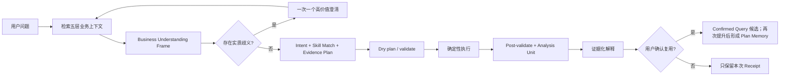

# 业务理解与分析 Skills

本文件是 AIBI-C 业务理解机制、首批业务理解 Skills 和本专题验收标准的唯一设计事实源。工作区清单、运行目录和字段画像见 [工作区上下文目录](workspace-context-catalog.md)，用户纠正与知识源审核见 [语义补丁与审核收件箱](semantic-review-inbox.md)，历史计划复用见 [确认计划记忆](confirmed-plan-memory.md)，语义与跨表执行细节见 [语义查询合同](semantic-query-planning.md)，当前实现状态见 [实现状态](implementation-status.md)。

> 研究快照：2026-07-16。当前状态：稳定初版；后续扩展仍由对应自动化、运行回执和产品验收共同确认。

## 目标与边界

目标不是让模型“更会猜”，而是让助手在回答前能定位业务概念、识别会改变结果的歧义、选择受限分析方法，并把每个结论绑定到当前工作区证据。

- Domain Pack 保存经审查的共享业务事实；Analytical Skill 保存分析方法，两者不能互相替代。
- 本地确定性语义运行时和 Verified Planner 决定字段、关系、计算与执行；Provider 只可排序候选或解释已验证证据。
- Skill 只能收缩已登记 Capability 的权限，不能引入代码、SQL、URL、MCP、Shell 或隐藏工具。
- 其他公开项目只提供问题拆解证据。本文未读取 AIBI-D/E 本地仓库，也不复制其代码、文档、配置、数据或运行状态。

## 五层业务上下文

业务问题必须按以下层次取证，不能把原始关键词直接映射成列名。

| 层次 | 回答的问题 | AIBI-C 权威来源 | 禁止行为 |
| --- | --- | --- | --- |
| Structural | 有哪些表、字段、类型、键、值形状和关系候选 | 当前工作区 Manifest、Runtime Catalog、字段画像和关系证据 | 从字段名或样例值断言业务含义 |
| Semantic | 字段承担什么角色，指标如何聚合，粒度和时间语义是什么 | 手工语义、指标/公式、已验证关系与 Domain Pack 声明 | 用模型偏好解决同名字段、比率或粒度冲突 |
| Business | 术语、状态、口径、排除项和规范来源是什么 | 已启用 Domain Pack、版本化规则和已确认示例 | 无 Pack 时注入行业默认值；按加载顺序解决冲突 |
| Operational | 本次能用哪些数据、版本、Evidence Run、Skill 和 Capability | 当前数据/Pack 指纹、运行状态、Policy 与资源预算 | 复用 stale 证据或让 Skill 扩权 |
| Behavioral | 用户希望怎样表达、展示和继续分析 | 当前工作区或 Session 的展示偏好与已确认交互 | 把个人措辞、图表偏好或聊天摘要晋级为共享业务事实 |

共享业务事实必须有来源、作用域、版本、状态和复核记录；个人表达只影响叙述或展示，不能改变公式、筛选、关系、粒度和执行权限。聊天纠正只能形成待审查提议，不能自动改写 Domain Pack、指标或全局别名。

Workspace Manifest、Runtime Catalog 与 Business Field Profile 已形成首版只读上下文。字段形状、角色候选、分类基数、空值/基数、时间覆盖和 PII 风险只作为 Structural/Operational 证据；分类原值始终保留在本地数据层而不进入上下文合同。手工保存和经 Review Inbox 明确接受的 `reviewed` 语义形成 confirmed 引用，候选不能授权 Join 或业务口径。字段清单与 freshness 规则不在本文复制，统一见 [工作区上下文目录](workspace-context-catalog.md)。

## 借鉴与拒绝

| 公开机制 | AIBI-C 决策 | 适配方式或拒绝原因 |
| --- | --- | --- |
| Wren AI 的结构、语义、业务、操作和行为上下文分层 | 吸收原则 | 映射到工作区 schema、Semantic Context、Domain Pack、运行证据和 Session 偏好；事实源保持可版本化 |
| Wren AI 的模型/关系/计算定义、规则检索和已确认问句示例 | 改造吸收 | 复用 AIBI-C 现有声明式语义、Confirmed Query 与 Receipt；检索结果只提供候选，不直接授权 SQL |
| Data-Analysis-Agent 的 knowledge-first 规则 | 吸收 | 使用用户原始业务词检索术语、定义和规则，再生成 Business Understanding Frame |
| Data-Analysis-Agent 的一次一个关键问题和可选项澄清 | 吸收 | 仅在候选会实质改变结果时提问；选项携带来源、影响和阻塞计划引用 |
| Data-Analysis-Agent 的 Skill 工作流、阶段路由和 allowed tools | 改造吸收 | 使用版本化声明式 Skill、固定 Capability Registry 与 Policy Hook；权限取交集，只能减少 |
| 新鲜 schema、样例和值域辅助消歧 | 有条件吸收 | 样例只能形成候选和置信度，不能把状态码、主表或业务键升级为事实 |
| SQL 模板或已确认 SQL 作为最高业务语义权威 | 拒绝 | 口径必须先成为 Metric/Semantic Contract，再由白名单规划器编译；历史 SQL 只能作为有来源的参考证据 |
| 按表前缀、样例或相似度自动跨表连接 | 拒绝 | 必须继续通过关系版本、基数、函数依赖、粒度、可达性和行膨胀证明 |
| 模型直接生成/执行 SQL、展示私有推理或自动保存纠正 | 拒绝 | 破坏可复现、权限与审计边界；只展示结构化计划、假设、证据和回执 |
| Skill/MCP/脚本按需增加新工具权限 | 拒绝 | Skill 不能绕过工作区、Capability、确认或出站策略 |

## AIBI-C 独立合同

### Business Understanding Frame

新增 `aibi-business-understanding-frame/v1`，在执行规划前记录业务理解结果：

- 原问题、`decisionGoal`、`taskType` 和期望输出；
- 指标、维度、实体、状态、时间、总体、筛选、比较基线、单位与粒度槽位；
- 五层上下文引用、每个候选的来源/版本/置信度和未覆盖槽位；
- 类型化 `ambiguities`、其 materiality、当前阻塞原因和下一条最高价值问题；
- `status`、主 `skillMatch`、`supportingSkills`、`unresolved`、`guards`、`blockers`、Domain Pack 引用和整体 fingerprint；状态至少区分 `ready | needs-clarification | blocked`。

它回答“这句话在当前业务上下文中可能是什么意思”；既有 `aibi-agent-intent-frame/v1` 继续回答“确定含义如何进入规划器”。两者以 fingerprint 绑定，不重复保存执行 SQL。

### 五层 Semantic Context Bundle

`aibi-semantic-context-bundle/v1` 向后兼容扩展为五层分区，并为每个条目保留 `sourceRef`、`scope`、`version`、`freshness` 和 fingerprint。检索顺序固定为确定性 exact/alias/type/relationship，再允许本地 reranker 调整顺序；任何排序都不能删除歧义或新鲜度阻塞。

### 类型化 Clarification

`aibi-agent-clarification/v1` 至少支持 `metric-definition`、`population`、`grain`、`time-range`、`comparison-baseline`、`dimension`、`status-meaning`、`relationship-path` 和 `output-purpose`。

- 一次只问一个会最大幅度缩小计划空间的高价值问题。
- 提供 2 至 6 个带来源和影响说明的候选，并允许自定义回答；不能输出纯文本编号菜单后继续猜测。
- 非实质性偏好不得阻断只读分析；实质性语义没有已验证默认值时不得静默补全。
- 回答必须记录 `answerSource`；若改变语义，旧 Intent、Evidence Plan 和未执行 Receipt 全部失效并重新规划。

### Analytical Skill 与 Match Receipt

`aibi-analytical-skill/v1` 向后兼容增加 `skillKind`、`triggerSignals`、`slotRules`、`semanticGuards` 和 `compatibleContracts`。既有字段继续声明版本、所需角色、Domain Pack、步骤模板、必需证据、阻塞规则、输出 schema、确认模式和资源上限。

`aibi-analytical-skill-match/v1` 必须记录候选、选中依据、缺失槽位、运行时 fingerprint、Skill 版本和最终 Capability 交集。多个同等级候选不得按文件顺序决胜；版本或 Registry 不兼容时阻断。Skill 资源仍是不可执行声明，不能携带 SQL、脚本或外部地址。

### Evidence Plan、Receipt 与已确认示例

`aibi-agent-evidence-plan/v1` 只消费已解析 Frame、当前 Context 和 Skill Match；查询前必须 dry-plan 并验证字段、粒度、比率和关系。查询后 `aibi-agent-completion-validation/v1` 复核数据/Pack/关系/Skill 指纹、结果形状和证据引用。

只有用户明确确认且 Receipt 当前可用的结果才能成为 Confirmed Query 候选；候选再次显式提升后才形成 Confirmed Plan Memory。计划记忆保留问题、结构化 selection、计划/Receipt 引用、工作区绑定和作用域，不把原始 SQL、Provider 推理或聊天摘要当作共享事实；召回只排序候选，推广到 Domain Pack 仍必须走独立复核。

## 首批六个业务理解 Skills

这些 Skill 已形成稳定初版；默认不要求行业 Pack，但只消费当前工作区已启用且兼容的语义。持续交付状态以验证回执为准。

| Skill ID | 解决的问题 | 关键输入与 Guard | 输出 |
| --- | --- | --- | --- |
| `business-question-framing` | 把含糊的业务问句变成可判定问题 | 决策目标、任务类型、对象、时间和输出；缺少会改变结果的槽位时只提出一个问题 | Business Understanding Frame 与下一步建议 |
| `metric-definition-resolution` | 区分同名指标、比率、人数/行数和不同总体 | 指标候选、分子/分母、去重实体、总体、筛选、粒度、单位；任何关键槽位未验证时阻断 | 已解析指标合同或类型化澄清 |
| `data-context-discovery` | 找到与问题相关的表、字段、术语、规则和缺口 | 五层上下文、新鲜度、来源与 PII 风险；样例只能支持候选 | 有界 Context Bundle、候选排序与缺口清单 |
| `cross-table-analysis-design` | 在执行前设计多表问题的根表、路径和最终粒度 | 必需表、实体键、时间字段、关系版本、基数/FD/放大/可达性证明；不安全即阻断 | 可验证的语义/关系计划或路径澄清 |
| `change-driver-diagnosis` | 解释指标为何变化而不是只报差值 | 已验证指标、时间窗口、比较基线、可分解维度和样本充分性；事实与假设分离 | 驱动贡献、证据强度、剩余假设和下一步 |
| `analysis-verification` | 在交付前独立检查理解、计划和结论 | Frame、Context、Skill Match、Receipt、Unit、关系证明与 freshness；零执行权限 | `pass | revise | block`、证据引用和可操作 blocker |

Skill 之间可以串联，但只有 Orchestrator 能提交已登记 Capability。`analysis-verification` 是只读复核，不得修写计划或绕过阻断；需要修改时返回 `revise` 并重新进入规划。

## 第二批通用方法 Skills

P1-B 已把六种常见分析方法实现为中立、声明式、可阻断的 Skill，而不是行业模板或可执行脚本。每个方法同时给出专用 `triggerSignals`、`slotRules`、`stepTemplate`、`requiredEvidence`、`semanticGuards`、资源上限和固定 Capability 交集。专用信号只从用户原问题和已验证 Intent 派生；没有专用信号时，方法 Skill 不参与普通任务的候选排序。

`aibi-analysis-method-plan/v1` 是被选中方法的只读计划投影，至少记录 Skill 身份与指纹、触发依据、状态、声明步骤、已解析与缺失槽位、证据、Guard、Capability 交集、资源上限和自身 fingerprint。它不包含 SQL、代码、外部地址、结果行或 Provider 推理，也不等同于已执行结果。方法计划随 Business Understanding Frame 进入 Evidence Plan；任何关键槽位缺失时，查询步骤保持阻断并只提出一个最高价值问题。

| Skill ID | 专用触发与必需槽位 | 固定方法步骤 | 失败行为 |
| --- | --- | --- | --- |
| `funnel-analysis` | 漏斗/转化路径；阶段集合、阶段顺序、实体键、时间范围与时间字段、总体 | 解析阶段 → 校验顺序与同一实体 → 锁定窗口 → 验证关系/粒度 → 计算逐阶段总体与流失 → 复核不变量 | 阶段含义或顺序不明、跨表路径未证明、分母总体漂移时阻断；不得把单一比率当完整漏斗 |
| `cohort-retention-analysis` | 留存/队列；实体键、入组事件、回访事件、队列周期、观察窗口与时间字段 | 定义入组 → 定义回访 → 固定观察窗口 → 构建互斥队列 → 计算分期留存 → 检查右删失与完整性 | 入组或回访事件不明、时间覆盖不足、实体不可去重时阻断；不得用行数代替留存实体 |
| `business-anomaly-triage` | 异常排查/分诊；指标、时间窗口、可比基线、粒度、分诊阈值 | 验证指标 → 建立可比基线 → 检查数据质量 → 定位异常切片 → 评估影响与证据强度 → 输出下一步 | 缺少可比基线、时间窗不完整或质量风险未分离时只报告不可判定，不生成业务原因 |
| `segment-contribution` | 分群/结构贡献；指标、分群维度、比较基线、贡献总体、粒度 | 锁定总变化 → 验证互斥/可加分群 → 计算分群变化与贡献 → 对账总体 → 标记残差 | 分群重叠、总体不可对账、粒度混合时阻断；贡献不得被表述为因果 |
| `driver-investigation` | 驱动调查/原因调查；指标、比较基线、候选驱动维度、时间窗口、粒度 | 量化变化 → 枚举已验证候选 → 独立拆解 → 控制总体与粒度 → 排序证据 → 区分事实、关联与假设 | 候选维度无来源、样本或比较不可比时阻断；不得从相关性宣称因果 |
| `dashboard-decision-design` | 决策看板/监控设计；决策目标、受众、复核节奏、核心指标、维度、时间范围与输出用途 | 定义决策 → 排列核心指标与 Guardrail → 绑定筛选/切片 → 选择兼容图形 → 复核来源与刷新边界 → 仅生成草案 | 目标、受众或指标未确认时不生成多组件看板；不得用占位指标、假数字或领域默认布局 |

匹配优先级固定为：显式请求的 Skill → 专用信号命中的方法 Skill → 通用 taskType Skill。专用候选以信号覆盖、缺失槽位、任务特异度、已匹配角色排序；实质同分仍要求显式选择，禁止按文件名或加载顺序决胜。显式请求只能选择已启用、合同兼容且能力受限的 Skill，不能绕过缺失槽位或 Policy Hook。

## 执行闭环

闭环必须满足：检索不等于采用；澄清不等于授权；Skill Match 不等于执行；dry validation 不等于结果正确；Confirmed Query 不等于共享业务定义。

## 验收矩阵

| 场景 | 必须观察到 | 失败信号 |
| --- | --- | --- |
| 中性表询问“收入/退款率” | 无已验证定义时给出带来源的候选并只问一个关键问题 | 注入电商定义或退化为 `COUNT(*)` |
| 同名字段分布在多表 | Structural 候选与 Semantic/Business 证据分层展示 | 按导入、列或模型顺序静默选择 |
| 状态码只在样例中出现 | 只能标为待确认候选 | 把样例值自动写成业务规则 |
| 三表业务问题 | 先解析实体、指标、时间和最终粒度，再走关系安全证明 | Skill 直接拼接 SQL 或跳过路径证明 |
| Skill 触发 | Match Receipt 显示版本、触发证据、缺失槽位和 Capability 交集 | Skill 解锁 Registry 外能力或同分候选静默决胜 |
| 数据、Pack 或关系发生变化 | 旧 Frame/Context/Plan/Receipt 进入 stale 并重新规划 | 继续引用旧证据回答 |
| 用户只要求“简短回答/用柱图” | 仅改变 Behavioral 层的表达和展示 | 个人偏好改变口径、筛选或关系 |
| 用户纠正一个术语 | 形成有来源、待复核的提议；当前回答保留其作用域 | 自动写入共享 Domain Pack 或跨工作区生效 |
| Provider 不可用或输出越界 | 本地闭环继续完成或明确阻断 | Provider 改字段、SQL、Capability 或 Receipt |

发布门槛：核心槽位正确率不低于 95%，已绑定字段 precision 不低于 98%，一次澄清后安全继续比例不低于 90%，完成回合证据覆盖和计划重放一致性为 100%，静默消歧、越权和跨工作区泄漏为 0。

固定 Business Expression Case、确定性评分算法、freshness 和设置页回执已按 [计划质量评测](plan-quality-evaluation.md) 交付；它们属于本地发布门禁，不再列入未来队列。

## 后续能力队列

本节只维护业务理解专题的后续顺序；跨产品优先级入口见 [未来开发队列](development-roadmap.md)。

1. `forecast-readiness` 仅在样本量、稳定性、泄漏、假设和可解释性门禁完成后进入开发；未达门槛时只输出准备度，不生成预测。

## 公开研究快照

以下只用于 clean-room 设计比较，访问时间均为 2026-07-16：

Wren AI：

- [Wren AI 官方仓库](https://github.com/Canner/WrenAI)
- [官方 Context 分层](https://docs.getwren.ai/oss/concepts/what_is_context)
- [MDL：业务语义合同](https://docs.getwren.ai/oss/engine/concept/what_is_mdl)
- [官方架构：context、planning、validation、execution 与 memory](https://docs.getwren.ai/oss/reference/architecture)
- [官方 Skills：随运行时版本交付的受控工作流](https://docs.getwren.ai/oss/reference/skills)
- [Memory：可审查规则与已确认问句示例](https://docs.getwren.ai/oss/concepts/memory_system)
- [Refine answer quality：规则、检索、确认和 enrichment 闭环](https://docs.getwren.ai/oss/guides/refine)

Data-Analysis-Agent：

- [官方仓库](https://github.com/Zafer-Liu/Data-Analysis-Agent)
- [Skills 目录](https://github.com/Zafer-Liu/Data-Analysis-Agent/tree/main/skills)
- [Funnel Analysis Skill](https://github.com/Zafer-Liu/Data-Analysis-Agent/blob/main/skills/funnel-analysis/SKILL.md)
- [Skill 数据合同与解析器](https://github.com/Zafer-Liu/Data-Analysis-Agent/blob/main/agent/skills/models.py)
- [Skill 执行与工具限制](https://github.com/Zafer-Liu/Data-Analysis-Agent/blob/main/agent/skills/executor.py)
- [动态工具暴露](https://github.com/Zafer-Liu/Data-Analysis-Agent/blob/main/agent/tools/exposure.py)
- [工作流阶段](https://github.com/Zafer-Liu/Data-Analysis-Agent/blob/main/agent/workflow_stage.py)
- [业务知识存储](https://github.com/Zafer-Liu/Data-Analysis-Agent/blob/main/Function/Knowledge/knowledge_base.py)
- [v1.1.0 LTS 发布说明（2026-07-02）](https://github.com/Zafer-Liu/Data-Analysis-Agent/releases/tag/v1.1.0)
- [许可证与商业使用边界](https://github.com/Zafer-Liu/Data-Analysis-Agent/blob/main/LICENSE)

外部项目的许可、运行模型和风险边界不同；AIBI-C 只独立实现上述合同与验收，不引入其依赖或源码。
