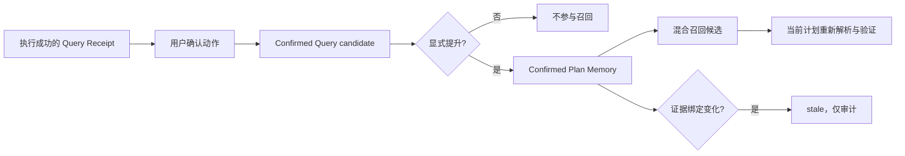

# Confirmed Plan Memory 与召回回执

本合同定义 AIBI-C 如何安全复用用户明确确认过的分析计划。它扩展既有 Confirmed Query，但不把历史问法当成当前业务事实，也不允许召回绕过字段歧义、关系验证、freshness 或执行权限。

## 用户结果

- 成功分析经确认后先形成候选；只有用户再次显式提升，才生成 Confirmed Plan Memory。
- 相近问法可看到历史候选、匹配依据和当前可用状态，不必从零寻找线索。
- 数据、字段语义、Domain Pack 或关系路径变化后，旧计划保留审计记录但进入 `stale`，不再参与召回。
- 设置页同时展示当前计划记忆与最近 Recall Receipt，并明确“仅候选，不自动采用”。

## 生命周期

计划记忆绑定原始 Query Receipt、结构化 selection、参与表、字段角色、聚合、证据引用和完整 Workspace Planning Binding。普通聊天、未确认草稿、候选 Query、Provider 叙述和 Session 摘要都不能晋级。

## 确定性混合召回

召回在当前工作区内组合问句 lexical 相似度、多语言字符 n-gram、当前与历史结构化计划重合、原 Receipt 实时 freshness。已显式选定表时，其他表的记忆直接排除。

各通道、权重、阈值和同分歧义边界进入版本化 policy。返回项始终带 `canAuthorizeSelection=false`、`canBypassAmbiguity=false`；历史字段不会被拼回当前 prompt，也不会自动补足指标、分子分母、时间窗口或关系路径。

## Recall Receipt

每次 Agent 召回都生成 `aibi-recall-receipt/v1`，包含 request hash、当前 Workspace Planning Binding fingerprint、版本化 policy、已检查和返回的候选、各通道得分、创建时间与 `no-match | candidates | ambiguous-candidates` 状态。

Receipt 固定声明 `candidate-only`、不可授权执行、不可绕过歧义与关系验证；不保存原始业务行、文档正文、凭据、绝对路径或任意可执行代码。Query Receipt 仍是结果与执行的唯一事实来源，Recall Receipt 只证明“为何展示这些候选”。

## 命令与界面

- `confirmed-queries`：查看 candidate、confirmed、stale 和 deprecated 问法。
- `confirm-query --query <key>`：预演提升或弃用；加 `--yes` 后执行。
- `confirmed-plans`：只读列出计划记忆及其证据绑定。
- `recall-receipts`：只读查看有界召回审计。
- API：`GET /api/confirmed-plans`、`GET /api/recall-receipts`；均只使用服务端活动工作区。

CLI 参数与副作用以 [CLI 合同](bi-cli-contract.md) 为准；产品验收见 [验收矩阵](product-acceptance-matrix.md)，当前状态见 [实现状态](implementation-status.md)。

## 失败行为与验收

- 未提升候选不得召回；召回不得改变同一问句的 Semantic Plan。
- 不同计划得分接近时保留多个候选并标记歧义，不静默决胜。
- 任一来源、Pack、关系或语义漂移都使 Query 与 Plan Memory 同步 stale。
- 工作区删除同步删除 Query、Plan Memory 与 Recall Receipt；跨工作区候选数必须为零。
- Confirmed Plan Memory 在 SQLite schema v9 引入；当前 schema v10 继续通过隔离预演、恢复点、应用失败和最终校验失败回滚保证兼容升级。
