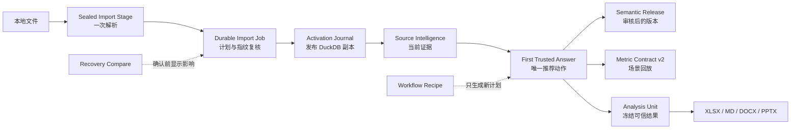

# AIBI-C 跨项目能力吸收与开发规格

## 1. 目标与适用边界

本规格记录从 AIBI-A、AIBI-B、AIBI-D、AIBI-E 的只读观察中提炼出的产品方法，以及它们在 AIBI-C 中按自身合同重新实现后的开发边界。目标不是把其他产品拼接进 AIBI-C，而是让新用户更快得到首个可信答案，同时让高级用户获得更强的语义、指标、恢复和交付能力。

以下规则始终优先：

- 五个 AIBI 项目是独立仓库和独立产品；不得复制代码、Fixture、配置、数据库、运行回执或端口状态。
- AIBI-C 的数据权威仍是工作区隔离的 SQLite 控制面与已发布 DuckDB 分析副本。
- Provider 只解释有界证据；解析、规划、查询、回执、写入和恢复由本地确定性运行时负责。
- 任何会改变业务状态的能力都必须预演、绑定指纹、显式确认并产生可复核回执。
- 借鉴项只有在减少用户步骤或强化可信边界时才进入产品；视觉新鲜感或技术炫技不足以成为开发理由。

## 2. 吸收决策矩阵

| 工作包 | 借鉴的优点 | AIBI-C 的独立实现 | 用户结果 | 当前状态 |
| --- | --- | --- | --- | --- |
| W0 密封导入阶段 | 把上传与正式导入解耦，避免重复读取 | 工作区隔离的 Sealed Import Stage；一次原始解析、SHA-256、TTL、配额与符号链接防护；Durable Import 只消费 stage | 同一文件不再为预检、确认和后台执行重复解析，响应丢失后仍可安全续作 | 已交付 |
| W1 首个可信答案协调器 | 新用户只看到当前最重要的一步 | 基于工作区、Import Job、Source Intelligence、Receipt 和草案状态选择唯一推荐动作 | 从空工作区到首个可信答案有连续主线，不被高级工具墙打断 | 已交付 |
| W2 语义版本发布 | 把零散语义修改组成可理解版本 | 多个 current Proposal 分组预演，再用精确指纹原子发布；版本漂移、历史与回滚分别呈现 | 用户知道“一次发布改变了什么”，语义变更不再逐条散落 | 已交付 |
| W3 Metric Contract v2 | 用业务合同和场景回放保护数字含义 | 版本化 population、grain、unit、null policy、dedup key、direction、owner；最多 12 个场景绑定已发布 DuckDB 结果 | 指标变动可区分定义漂移、数据漂移或二者同时发生 | 已交付 |
| W4 知识源与模型设置 | 将业务知识和模型运行分开管理 | 本地受限 JSON/Markdown 只生成不可变审核提案；Runtime Profile 独立管理 Provider、模型和预算 | 业务知识不会被模型设置或自动学习静默覆盖 | 已交付 |
| W5 Workflow Recipe | 复用成功流程，而不是复用旧授权 | Recipe 只冻结登记 Capability 的顺序、输入占位符和确认边界；实例化只生成新计划 | 常见任务少走重复步骤，每次仍重新绑定当前工作区与证据 | 已交付 |
| W6 恢复影响对比 | 高风险恢复前先显示影响 | 先验证恢复点，再比较 current 与 target 的表版本、来源和状态指纹；不读取业务行 | 用户确认前知道哪些表会恢复、移除或降到旧版本 | 已交付 |
| W7 办公交付 | 分析结果直接进入日常协作材料 | 同一 current Receipt/Analysis Unit 可导出 XLSX、Markdown、DOCX、PPTX；统一脱敏、哈希和无重查边界 | 可信分析直接形成文档和汇报材料，不需手工复制数字 | 已交付 |

## 3. 未吸收的做法

以下做法即使能缩短演示路径，也不进入 AIBI-C：

- 根据文件名、第一张表或“最像的字段”静默决定分析范围。
- 让 Provider 生成任意 SQL、脚本或工具调用后直接执行。
- 导入预检后再次从原始路径解析，或由后台 Job 依赖用户当前 active workspace。
- 把历史 Recipe、Recall Memory 或旧 Analysis Unit 当作新操作的授权。
- 未经审核自动学习本地文档、数据库、代码仓库或网络页面。
- DuckDB 不可用时回退 SQLite 业务表并继续给出经营数字。
- 为了恢复方便而回滚 Ledger、Receipt、Job Event 或 Activation Journal。
- 在导出阶段重新查询或把绝对路径、凭据、编译参数写入文档。

## 4. 总体流程

## 5. 详细开发合同

### 5.1 Sealed Import Stage

输入文件先复制到 AIBI-C 本地 stage 根目录的工作区桶中；manifest 绑定工作区、内容哈希、大小、解析摘要、创建时间和到期时间。预检、确认和 Durable Job 使用同一个 `stageKey` 与绑定指纹。

安全与退出条件：

- 只允许普通文件，不跟随符号链接，不接受另一个 AIBI 仓库路径。
- 默认保留七天并执行有界配额；过期、篡改、跨工作区或缺失 stage fail closed。
- 预检不写业务表；确认后 Job 不重新读取用户原始路径。
- 单文件、文件夹、结构变化与旧同步兼容入口均进入相同 Durable Import/Activation 边界。

### 5.2 First Trusted Answer Coordinator

协调器不创建第二套状态机，只消费现有权威状态并返回一个推荐动作。优先级依次为：处理 `needs_attention`、等待或恢复 Import Job、完成 Source Intelligence、发起首个问题、核对可信结果、确认待处理草案。

安全与退出条件：

- 同一时刻只显示一个主要动作；高级入口仍可按需展开。
- 刷新后从服务端 Job、Run、Receipt 恢复，不以 React 临时状态冒充生命周期。
- 错误状态不得回退到旧数字或另一个工作区对象。

### 5.3 Semantic Release

Release 将一组目标不冲突、仍为 pending 且输入新鲜的 Proposal 冻结成一个版本。预演返回变更列表和 `planFingerprint`；发布必须沿用同一稳定 `requestKey` 与精确指纹。发布事务同时写 confirmed 语义、Proposal 决策、Release 与事件。

回滚是独立的预演—确认操作，仅在已发布目标仍与 Release 指纹一致时允许；目标漂移后 Release 标记 stale，保留历史但不覆盖当前事实。

### 5.4 Metric Contract v2

每个版本必须显式声明统计范围、粒度、单位、空值策略、去重键、好坏方向和责任人。场景只允许登记查询参数，执行委托 current validated DuckDB reader；公开合同保存参数指纹，不保存敏感筛选值。

发布冻结场景 baseline；重放输出：

- `definition-drift`：合同定义已变化；
- `data-drift`：定义相同但 current 数据结果变化；
- `definition-and-data-drift`：两者同时变化；
- `current`：定义和结果均一致。

数值场景额外返回 scalar delta；非标量场景只比较结果、行数与列数指纹。

### 5.5 Knowledge Source 与 Runtime Profile

知识源 UI 只接受本地 `.json`、`.md` 及其声明式 Adapter；网络、SQL、代码和任意二进制输入不进入此入口。确认后保存的是脱敏快照与 Semantic Patch Proposal，不保存原始文档或业务行，也不直接修改答案口径。

Provider、模型、wire API、预算与 shadow evaluation 继续由工作区 Runtime Profile 管理。知识源决定“哪些业务事实可进入审核”，Runtime Profile 决定“由哪个可选模型解释已批准证据”，两者不得合并。

### 5.6 Workflow Recipe

Recipe 由 1–12 个已登记 CLI Capability Stage 组成；递归 Recipe、任意代码、SQL、URL 和 Registry 外命令均被拒绝。发布使用稳定请求键与精确预演指纹，版本按名称递增。

实例化时占位符如 `${reason}`、`${receiptKey}` 必须用当前输入重新绑定；返回各阶段 Capability、mutation mode、确认要求和 blocker。`executesAutomatically` 永远为 `false`，写入阶段仍回到其所属页面逐项确认。

### 5.7 Recovery Compare

对比接口先完整验证 manifest、文件大小、SHA-256 与同工作区归属，再将恢复点 `sourceVersions` 与 current `table_registry` 比较。公开结果只包含 table key、current/target dataVersion、来源 run 与状态指纹。

变化分为：

- `restore`：当前缺失、恢复点存在；
- `remove`：当前存在、恢复点不存在；
- `version-change`：两侧都存在但版本不同；
- `unchanged`：表版本一致。

对比是只读诊断，可在恢复 fence 下使用；真正 restore 仍需要独立预演、自动安全点和显式确认。

### 5.8 XLSX、DOCX 与 PPTX 导出

导出只接受 current executed Query Receipt 与 ready Analysis Unit，复核 Receipt/Unit 结果指纹和来源新鲜度后生成确定性 ZIP。默认保持 XLSX + Markdown；用户可选择 Word、PowerPoint 或完整交付包。

- XLSX：Summary、Data、Evidence、Manifest 四张结构化工作表，并仅对兼容形状生成原生图表。
- DOCX：标题、状态、口径、计算、最多 100 行可读快照、验证与限制。
- PPTX：封面、结论与可信状态、最多 8 行结果摘要、证据与限制四页。
- 全部格式共享脱敏函数、禁止绝对路径/凭据/compiled SQL，导出阶段不重新查询、不写业务数据库。

## 6. UX 一致性

- 所有设置面板使用惰性加载，避免把高级能力加入首屏主 bundle。
- 知识源、语义版本、指标合同、Recipe 和恢复均采用“预演 → 影响摘要 → 精确确认”同一交互语言。
- 窄屏 720×1280 与横屏 1280×720 保留任务顺序和可触达按钮；复杂清单在容器内变为单列，不产生横向溢出。
- 状态同时使用文本、结构和颜色；长名称、双语文案、错误与指纹允许换行或安全截断。
- 首页继续只给一个推荐动作；新增能力位于用户需要它们的上下文内，不形成第二套导航体系。

## 7. 验证与发布门禁

每个工作包都有后端、API/路由或 UI 专项；公共发布还必须通过：

- parser、registry、四领域 dispatch 对账和实时 CLI 合同；
- TypeScript、Python compile、production reachability 与 bundle budget；
- 工作区隔离、跨引擎纯读、Durable Import、恢复、证据与权限门禁；
- 核心产品合同与真实浏览器 1280×720、720×1280 检查；
- 完整 `npm run preflight -- --stop-after`，并确认 8787/8686 无残留监听。

专项命令和实时数量只维护在 `package.json` 与运行回执，不复制到本文件。

## 8. 后续演进边界

本批没有引入远程协作、云知识库、自动调度 Recipe、任意 SQL/代码工具或 PDF 生成。后续如需扩展，必须先证明：新能力能减少真实用户步骤；不扩大 Provider 权限；不跨工作区；失败时有稳定恢复动作；并能用当前 Receipt、Ledger、Job 与恢复合同给出可复核证据。
