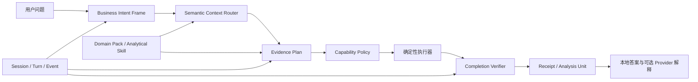
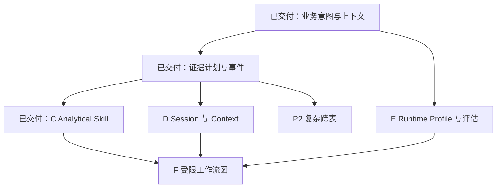

# AIBI-C 未来开发队列

本文件是唯一未交付工作队列。当前能力见 [实现状态](implementation-status.md)，稳定需求见 [PRD](PRD.md)，扩展边界见 [通用扩展运行框架](extensible-domain-framework.md)。

## 研究范围与结论

本轮在 2026-07-15 只读研究以下当前源码快照：

- DB-GPT `main@7996544a`：数据分析 Planning Agent、AWEL、Schema Linking、Agent Context、Skills、Memory、Sandbox 与多数据源资源模型。
- Open Interpreter `main@71f03214`：当前仓库已转为基于 Codex 的低成本模型 Coding Agent，重点是 Provider/Harness、Session、结构化事件、Permissions、Skills、Hooks、MCP 与本地 App Server；本规划不按旧版 Python/Shell 聊天执行器理解它。

结论：AIBI-C 最值得吸收的不是“让模型自由写 SQL 或代码”，而是把现有的确定性 BI 能力组织成更强的业务意图理解、上下文路由、证据计划、可恢复会话、受限技能和可观测 Agent 回合。所有实现都必须重新设计，不能引入两个项目的运行依赖、代码或默认权限。

## 借鉴决策

| 来源能力 | 对 AIBI-C 的价值 | 决策 | AIBI-C 形态 |
| --- | --- | --- | --- |
| DB-GPT Planning Agent | 把复杂分析拆成可检查步骤，并根据结果调整后续计划 | 优先吸收 | Evidence Plan；每步绑定 Capability、输入、预期证据与阻塞条件 |
| DB-GPT Schema Linking / RAG | 从大量表、字段、指标和知识中召回与问题相关的上下文 | 优先吸收 | Semantic Context Router；确定性召回优先，可选本地 embedding 只参与排序 |
| DB-GPT AWEL | 类型化 DAG、分支、合并、流式输出与 Operator 复用 | 改造吸收 | 在 Workflow Stage 和 Durable Job 上增加受限分析图，不执行任意 Operator |
| DB-GPT Skills | 把领域方法和重复流程封装成可复用单元 | 优先吸收 | 声明式 Analytical Skill；只能引用已登记 Capability 和输出 schema |
| DB-GPT Context Management | 分层压缩长回合，并保留大型工具结果的快照引用 | 优先吸收 | Evidence-aware Context Manager；先确定性压缩，永不丢失 Receipt/Unit 指针 |
| DB-GPT Multi-Agent | 角色分工和并行子任务 | 延后验证 | 只允许只读 Planner/Reviewer，无独立工具权限，不形成自由协作群 |
| DB-GPT 自主 Text2SQL / Code | 能快速覆盖开放式任务 | 不吸收执行方式 | 模型只输出结构化意图；SQL 仍由白名单编译器生成 |
| Open Interpreter Provider/Harness | 不同模型使用不同 wire API 和可靠性提示，但共享运行时 | 优先吸收 | Agent Runtime Profile；Provider 适配不得改变业务语义和能力权限 |
| Open Interpreter Session / Fork / Compact | 长任务可恢复、可分支且保留原会话 | 优先吸收 | 工作区级 Agent Session；分支绑定父 Turn、Receipt、Unit 与上下文指纹 |
| Open Interpreter JSON Events / App Server | 前端可实时展示计划、工具请求、审批和结果 | 优先吸收 | `aibi-agent-turn-event/v1` + SSE/NDJSON；短请求和 Job 共用事件语义 |
| Open Interpreter Permissions / Exec Policy | 技术权限与人工审批分离，默认拒绝 | 改造吸收 | Capability Policy；按资源、工作区和 mutation mode 判定 allow/confirm/forbid |
| Open Interpreter Skills 懒加载 | 先读元数据，命中后再加载完整工作流 | 优先吸收 | Skill Catalog 两阶段发现，减少上下文和错误领域激活 |
| Open Interpreter Hooks / Verify turn | 工具前后检查和完成前复核 | 优先吸收 | Policy Hook 与 Completion Verifier；Hook 不能是任意脚本 |
| Open Interpreter MCP / Computer Use | 生态广、可操作外部系统 | 暂不进入产品运行时 | 仅研究只读 Adapter；浏览器控制只用于开发验收 |
| Open Interpreter Shell / 全权限模式 | 通用性强但破坏面大 | 明确拒绝 | 产品 Agent 不获得 Shell、文件写入、任意网络和主机控制 |

## 目标架构

原则：模型可以帮助解析、排序、解释和建议重规划，但不能直接选择未验证字段、编写执行 SQL、调用未登记工具、跳过确认或把自然语言记忆当作业务事实。

## 核心合同

### Business Intent Frame

新增 `aibi-agent-intent-frame/v1`，把一句问题规范化为：

- `taskType`：概览、比较、趋势、构成、排名、异常、对账、诊断或不支持；
- `decisionGoal`：用户想据此判断什么，可为空但不能由模型补造；
- `measureConcepts`、`dimensionConcepts`、`timeScope`、`filters`、`comparisons`；
- `requestedOutput`：答案、图表、看板草案、证据、导出或维护动作；
- `grainExpectation`：期望统计单位和去重实体；
- `constraints`：上限、排序、阈值、时间窗口和显式表；
- `unresolved`：缺失语义、候选冲突和必须澄清项；
- `evidenceRefs` 与逐槽位 `confidence`。

“业务语义理解”必须沿 `用户表达 -> 业务概念 -> 指标/维度角色 -> 统计粒度 -> 字段候选 -> 规则证据` 逐层解析，不能把关键词直接映射为列名。

### Semantic Context Bundle

新增 `aibi-semantic-context-bundle/v1`，只包含当前工作区且与问题相关的：

- 表与字段候选、结构角色、人工语义和数据版本；
- 指标、公式、关系路径、粒度和验证状态；
- Context Pack 术语/规则、已确认查询和当前 Evidence Run；
- 已启用 Domain Pack 与可用 Analytical Skill 元数据；
- 每个候选的召回原因、得分、来源、指纹与过期状态；
- 未覆盖的意图槽位和为什么没有安全候选。

先运行确定性 exact/alias/type/relationship 召回，再允许本地 embedding 或 Provider 对候选重新排序。任何排序都不能消除歧义门禁。

### Evidence Plan

新增 `aibi-agent-evidence-plan/v1`。每个 Step 至少包含：

- `stepKey`、`kind`、`capabilityId`、`dependsOn`；
- `inputRefs`、`inputFingerprint`、`requiredEvidence`；
- `outputSchema`、`mutationMode`、`workspaceId`；
- `status`、`blockers`、`retryPolicy`、`completionChecks`；
- 运行后 `artifactRefs`、`evidenceRefs` 和 `outputFingerprint`。

计划只允许注册表中的 Capability。读步骤可自动执行；草案步骤只生成候选；真实写入继续使用现有 dry-run/confirm；禁止步骤在计划阶段直接阻断。

### Agent Turn Event

新增 `aibi-agent-turn-event/v1`，事件序列在一个 Turn 内严格递增：

`accepted -> intent-resolved -> context-ready -> plan-ready -> step-started -> approval-required -> step-completed/blocked -> validation-completed -> answer-ready -> turn-completed/failed/canceled`

每个事件记录工作区、Session、Turn、Step、序号、时间、公开摘要和证据引用，不记录模型私有推理、密钥、原始行或未经脱敏的 Provider 错误。

### Analytical Skill

新增 `aibi-analytical-skill/v1` 声明式 Manifest：

- 名称、版本、用途、触发描述和适用 task type；
- 需要的语义角色、关系、粒度与 Domain Pack；
- 允许的 Capability、步骤模板和输出 schema；
- 必需证据、阻塞规则、确认模式和资源上限；
- 正向、歧义、缺字段、过期和冲突测试。

Skill 只描述如何组合 AIBI-C 能力，不包含 Python、JavaScript、Shell、SQL、HTML 或任意网络调用。Knowledge Pack 维护业务规则，Analytical Skill 维护分析流程，两者不得合并为提示词文件。

### Agent Runtime Profile

新增 `aibi-agent-runtime-profile/v1`，统一 Provider、模型能力和运行预算：

- provider、model、wire API、结构化输出能力和 context window；
- reasoning budget、最大输出、超时、重试和降级策略；
- 允许参与的阶段：意图、候选排序、计划建议、解释、完成复核；
- Context Budget、脱敏策略和出站字段白名单；
- 版本与 fingerprint。

Profile 类似 Open Interpreter 的 Provider/Harness 分离，但只适配通信和可靠性，不携带业务口径，也不新增工具权限。

## 不变的主流程

`接入数据 -> 生成证据 -> 描述问题 -> 核对结果 -> 确认写入`

新能力只增强“描述问题”到“核对结果”之间的理解和执行透明度，不增加新手默认步骤。简单单表问题仍走最短路径，只有复杂任务才展开计划。

## 当前队列

### 阶段 D：可恢复 Session、分支与上下文管理

目标：吸收 Open Interpreter 的 resume/fork 和 DB-GPT 的分层 Context Management，同时严格区分“对话历史”和“已确认业务语境”。

数据模型：

- `agent_sessions`：工作区、标题、状态、当前 Turn、Runtime Profile 和上下文指纹；
- `agent_turns`：问题、Intent、Context、Plan、终态、父 Turn 和结果引用；
- `agent_turn_events`：严格序号事件；
- `agent_context_snapshots`：压缩摘要、保留对象引用、原始证据位置和 fingerprint。

行为：

1. Resume 只在同一工作区恢复；目标对象已删除或版本变化时先显示失效面。
2. Fork 创建新 Session/Turn，不修改原链；分析分支继续要求父 Receipt/Unit 已确认。
3. 上下文分四层压缩：裁剪旧展示文本 -> 移除完整旧回合但保留对象引用 -> 生成结构化摘要 -> Provider overflow 后一次反应式压缩。
4. Receipt、Unit、Plan、确认/拒绝历史、未决项和当前对象不能被压缩掉；大型结果只保留指纹与安全快照引用。
5. 不自动生成长期业务记忆；只有明确晋级的 Confirmed Query、Context Term/Rule 和手工语义可跨 Session 召回。

迁移：Agent Turn 与 Skill 状态已在 SQLite v5 持久化；Session 与 Snapshot 合入时必须从 v5 递增，走隔离副本、恢复点和双库复检。

退出条件：重启后可恢复 Session；Fork 不污染父链；压缩前后关键对象、证据和阻塞结论一致；跨工作区 Session 不可见。

### 阶段 E：Provider Runtime Profile 与评估体系

目标：从当前 deterministic/DeepSeek 二选一扩展为受控 Provider Registry，同时保证任何模型都服从同一业务合同。

1. Provider、模型和 Runtime Profile 分离；支持 DeepSeek 与显式配置的本地 OpenAI-compatible endpoint，其他远程 Provider 逐个审查。
2. 按模型能力选择结构化输出、context window、reasoning budget 和重试策略，不能选择不同的业务语义词表。
3. 所有 Provider 输出必须通过 JSON Schema、数字 grounding、字段候选、Capability 和 evidence ref 校验。
4. 记录脱敏的请求 fingerprint、模型、Profile、耗时、token、估算成本、重试、降级和验证结果。
5. 支持 shadow evaluation：同一 Intent/Context 离线比较多个 Profile，但只有确定性主路径可以写 Receipt 或草案。
6. 建立固定评估集和回归看板，不以单次主观回答决定默认模型。

退出条件：切换 Provider/Profile 不改变相同 Intent、Capability、Receipt 和确认边界；Provider 故障不影响本地 BI；敏感字段和原始行零出站。

### 阶段 F：受限工作流图与只读专家

目标：在已有阶段稳定后，再吸收 AWEL 的 Branch/Join 和多角色协作，而不是立即构建自由多 Agent。

1. 只开放固定 Operator：context、resolve、clarify、query、validate、unit、chart、explain、export、branch、join。
2. 只读且互不依赖的 Step 可以并行；写入、关系变更和依赖相同数据版本的 Step 串行。
3. Planner、Semantic Reviewer、Evidence Reviewer 和 Narrator 是同一 Turn 内的角色视图；只有 Orchestrator 能提交 Capability 请求。
4. Reviewer 只能返回结构化通过/阻断/修订建议，不能直接执行工具。
5. Join 必须验证所有父 Step 的 workspace、plan version、data/Pack fingerprint 和证据完整性。

退出条件：并行不会改变确定性结果或事件顺序语义；任一专家失败可降级为单 Orchestrator；无工具权限泄漏或循环重规划。

### P2. 更复杂的跨表执行

目标：在 Intent Frame 和 Evidence Plan 已能说明统计粒度、关系依赖与证据缺口后，扩展当前一跳与线性正向两跳能力。

- 定义三跳、反向路径、跨跳筛选和预聚合的静态安全合同。
- 覆盖 fan-out、复合键变化、迟到维度、桥接表和版本漂移的阻断与复算。
- 把每跳输入/输出粒度、行数变化、函数依赖和预聚合证明写入 Plan Step 与 Receipt。
- 无法证明安全时继续澄清或阻断，不能以“查询可运行”代替正确性证明。

退出条件：新路径具有确定性计划、数据版本绑定、膨胀证明、完成复核和浏览器可解释回执。

## 实施顺序与依赖

业务意图、上下文、证据计划、事件、声明式 Skill 与固定 Policy Hook 已经交付；D 是当前主链，E 可按独立改动面推进；F 和复杂跨表不得提前绕过前置合同。

## 评估与发布指标

| 指标 | 含义 | 发布门槛 |
| --- | --- | --- |
| Intent slot accuracy | task type、指标、维度、时间、筛选和输出槽位正确率 | 核心槽位不少于 95% |
| Field binding precision | 已绑定字段是否真是用户表达目标 | 不少于 98% |
| Unsafe resolution count | 静默消歧、过期关系、比率退化和越权执行 | 必须为 0 |
| Clarification usefulness | 澄清一次后能安全继续的比例 | 不少于 90% |
| Evidence completeness | 完成 Turn 的必需 evidence ref 覆盖 | 100% |
| Plan replay fidelity | 同一指纹计划重放是否得到相同结果 | 100% |
| Session resume fidelity | 恢复后关键对象、阻塞和确认状态一致 | 100% |
| Provider fallback success | Provider 故障时本地路径仍完成或明确阻断 | 100% |
| Cross-workspace leakage | Session、候选、Skill、事件和证据串扰 | 必须为 0 |

每个阶段都要增加静态合同、临时数据库运行回归、CLI/API 一致性和真实浏览器验收；测试输入只能进入临时工作区。

## 暂不开发

- 模型生成任意 SQL 后直接执行，或把 SQL sandbox 当作语义正确性证明。
- Python、JavaScript、Shell、包安装、主机文件写入或通用 Computer Use 产品能力。
- `yolo`、自动批准全部动作、危险全权限 Profile 或允许 Skill 绕过确认。
- 任意 MCP Server 自动发现；如未来接入，只能经过 Adapter、Capability、工具白名单和逐工具审批重新设计。
- 无来源的长期记忆、自动把聊天内容晋级为业务事实、跨工作区召回会话。
- 让多个 Agent 自由互调工具、共享未脱敏上下文或无限循环重规划。
- 用模型专用 Harness 夹带字段别名、行业口径或写入权限。
- 云端账号、多人协作、远程托管、多租户和隐藏遥测。

## 演进与兼容策略

1. 先以 shadow 模式生成 Intent/Context/Plan，不改变当前答案或业务状态。
2. 基准达到门槛后，对复杂只读问题启用新计划；简单问题仍走最短路径。
3. 再让新计划承载草案创建；确认执行继续复用现有 Action Draft。
4. Session 与 Skill 持久化必须通过 schema 迁移、配置导出/恢复和旧对象回放。
5. 新路径稳定后删除重复启发规则，不长期维护两套事实源。
6. 任一阶段失败可关闭新入口并回到当前确定性路径，不能靠重解释历史 Receipt 回滚。

## 研究来源

DB-GPT：

- [项目主页](https://github.com/eosphoros-ai/DB-GPT)
- [Data Analysis Planning Agent](https://github.com/eosphoros-ai/DB-GPT/blob/main/docs/data_analysis_planning_agent.md)
- [Agent Context Management](https://github.com/eosphoros-ai/DB-GPT/blob/main/docs/docs/agents/modules/context-management.md)
- [Built-in Skills](https://github.com/eosphoros-ai/DB-GPT/blob/main/docs/docs/dbgpts/built-in-skills/overview.md)
- [Sandbox](https://github.com/eosphoros-ai/DB-GPT/blob/main/docs/docs/sandbox/index.md)
- [AWEL 数据问答示例](https://docs.dbgpt.cn/docs/awel/cookbook/write_your_chat_database/)

Open Interpreter：

- [当前项目主页](https://github.com/openinterpreter/openinterpreter)
- [配置与 Harness](https://www.openinterpreter.com/docs/terminal/config)
- [Sessions](https://www.openinterpreter.com/docs/terminal/sessions)
- [Sandbox 与 Approvals](https://www.openinterpreter.com/docs/terminal/sandbox)
- [Permissions](https://www.openinterpreter.com/docs/terminal/permissions)
- [Skills](https://www.openinterpreter.com/docs/terminal/skills)
- [结构化 Exec 事件](https://www.openinterpreter.com/docs/terminal/exec)
- [App Server](https://www.openinterpreter.com/docs/terminal/app-server)

外部项目只能作为设计证据；AIBI-C 的实现、schema、测试、运行时和验收必须独立完成。

## 维护规则

- 只保留未交付事项、依赖、验收门槛和退出条件。
- 交付后从本文件移除，并把稳定能力写入实现状态、PRD 和验收矩阵。
- 外部来源变化时先更新研究快照和借鉴结论，不静默改变开发范围。
- 不在本文件复制实时命令数、检查数、日期回执或已完成流水账。
