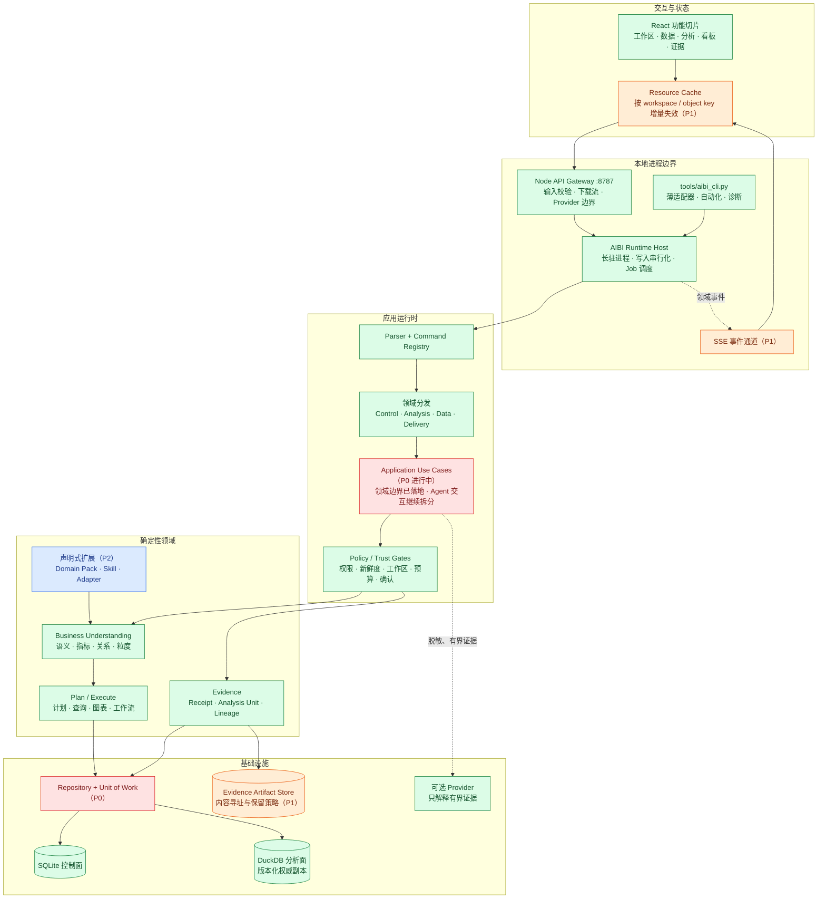

# AIBI-C 未来开发队列

本文件是跨产品未交付工作队列。当前能力见 [实现状态](implementation-status.md)，稳定需求见 [PRD](PRD.md)，业务理解专题的合同、Skills、验收与细分顺序见 [业务理解与分析 Skills](business-understanding-skills.md)。持久导入、恢复点、激活日志、审核证据、SQL Server、决策框架与召回评测的执行合同见 [可信能力吸收开发规格](trusted-capability-absorption.md)；AIBI-A/B/D/E 只读借鉴及本轮已落地的密封导入、语义版本、指标合同、Recipe、恢复对比和办公导出见 [跨项目能力吸收与开发规格](cross-project-capability-development.md)。

## 不变的主流程

接入并识别数据 → 形成业务理解 → 生成受约束的分析计划 → 执行或只澄清一个关键歧义 → 用证据回执交付结果；任何写入仍需显式确认。

## 目标架构

下图是本地单体产品的目标边界，不意味着拆成远程微服务。绿色节点已经落地；红、橙、蓝节点分别是 P0、P1、P2 演进面。

Node API 已通过长驻 Runtime Host 进入统一 Registry，独立 CLI 仍以薄适配器进入同一运行时；两者只保留协议适配职责，业务行为由同一组 Use Case 和 Guard 决定。持久 Import Job、来源激活 Journal、工作区恢复、审核 Ledger、SQL Server 只读快照激活、决策框架与安全降级召回已移入 [实现状态](implementation-status.md)。

## P0：消除运行时结构性风险

### P0-A｜拆出 Application Use Case（进行中）

- 用户结果：网页、CLI、Job 对同一动作得到完全一致的计划、阻断和回执。
- 实现边界：把当前组合内核中的 `ask`、语义查询、导入、确认、看板交付拆成显式 Use Case；每个 Use Case 接收类型化 Command，返回统一 Result，不读取进程参数。
- 失败行为：未知命令、缺失工作区或不满足 Guard 时返回结构化失败，不回退到其他命令或通用聚合。
- 退出条件：组合内核只负责依赖装配；Agent Interaction 拆成 Prompt Resolution、Read Snapshot、Answer Composition、Action Confirmation 等可独立测试的 Use Case，单个应用服务不再持有跨分析阶段的写事务；当前登记命令合同无非预期变化；专项和完整回归通过。
- 当前批次：组合内核已退化为 12 行兼容导出面，原“800 行以内”目标已经完成；后续热点是拆分 Agent Interaction、缩短写事务并引入类型化 Command/Result。当前实现事实由 [实现状态](implementation-status.md) 维护。

### P0-D｜闭合服装电商可信查询

- 用户结果：从一次确认的多文件批次得到 current sourceRun 后，中文筛选、时间、粒度和商品方法只在真实执行计划完整覆盖时返回经营数字。
- 实现边界：唯一合同见 [服装电商可信查询 v1](apparel-commerce-trusted-query.md)；Core 管 QueryIntent、Import Plan、Binding、Proof、Receipt 与结果状态，Domain Pack 只贡献服装实体候选和方法要求。
- 失败行为：自动键、计划漂移、非 current sourceRun、未下推筛选/时间、未证明实体映射、非 executed 结果或方法证据不足全部 fail closed。
- 退出条件：Trusted Execution Gate、Atomic Import Plan、Apparel Entity Mapping Proof、排行/集中度/Pareto 和五态 UI 均通过确定性与客户路径验收。

### P0-E｜收紧一次写入与本地调用者边界

- 用户结果：网络抖动、代理失效、重复点击或恶意网页都不能造成重复写入；失败能看到原始原因并安全重试。
- 实现边界：mutation 只发送到一个确定端点，使用版本化 Command Envelope、稳定幂等键、同源/loopback caller 校验、JSON Content-Type 和启动期能力令牌；Capability Contract 在 handler 前执行。
- 失败行为：响应丢失返回可查询的幂等回执；Origin、Host、令牌、能力或 envelope 不匹配时在任何业务调用前拒绝，数据库与文件零变化。
- 退出条件：响应丢失、双击、跨站 POST、过期 Session、Host 欺骗和 Capability 越权故障注入均通过，且每个 mutation 的 handler 调用次数最多一次。

### P0-F｜消除前端数字与对象静默回退

- 用户结果：缺失对象、关系查询失败和软 API 失败不会显示另一个对象、旧结果或成功提示；用户始终知道当前状态和恢复动作。
- 实现边界：对象、查询和 mutation 使用类型化 `idle | loading | ready | error | stale` 状态；URL 对象不存在时进入恢复空态，关系组件只消费自身 Query Receipt，失败信息靠近触发位置。
- 失败行为：任何非 current、未绑定或 `ok: false` 结果都卸载业务数字并保留用户输入；确认操作条不得遮挡待核对内容。
- 退出条件：刷新/前进/后退/删除对象、关系查询失败、过期 Session、低高度窗口和键盘路径均通过真实浏览器回归，错误数字、静默成功与内容遮挡为零。

## P1：降低前后端耦合与刷新成本

### P1-A｜资源缓存、精确失效与 SSE

- 用户结果：保存一个关系或看板组件时，只刷新受影响对象；长任务进度自动更新，页面不再全局闪烁。
- 实现边界：客户端按 `workspaceId + resourceType + objectKey` 缓存；Mutation Receipt 返回 invalidation keys；SSE 只传领域事件和版本，不传业务结果行。
- 退出条件：核心写入路径没有无条件全量刷新；断线重连、跨工作区切换、历史路由和 stale event 均有测试。

### P1-B｜建立跨语言合同层并纠正依赖方向

- 用户结果：前端、API、CLI 的字段和错误语义同步演进，升级后不会因隐式 shape 差异破坏页面。
- 实现边界：建立独立 `shared/contracts`，从同一 schema 生成或校验 TypeScript/Python 类型；`server/` 不再导入 `src/` 页面模型，页面只依赖公共合同和客户端适配器。
- 退出条件：架构门禁阻断 server → UI 反向依赖、未登记 envelope 和未版本化公共字段；兼容性夹具覆盖前一合同版本。

### P1-C｜证据制品内容寻址与保留策略

- 用户结果：相同证据不重复占用空间，删除、导出和审计都能解释引用关系。
- 实现边界：大结果、快照和导出进入 workspace 隔离的 CAS；SQLite 只保存 hash、大小、mime、lineage 和引用计数；保留、擦除与 tombstone 由显式策略驱动。
- 退出条件：原子写入、hash 校验、孤儿回收、配额、导出重放和安全删除验证通过。

## P2：形成可扩展但不扩权的插件面

### P2-A｜声明式扩展 SDK 与静态 lint

- 用户结果：新行业语义、分析 Skill 和 Connector Adapter 可以独立安装、检查、启停和升级，不污染 Core 默认行为。
- 实现边界：只开放版本化 Manifest、schema、Capability 引用和受控 Adapter 接口；不加载任意 Python、SQL、HTML 或 Shell。
- 退出条件：兼容矩阵、签名、权限差异、升级/回滚、workspace portability 和隔离测试闭环。

### P2-B｜统一 Trace、容量预算与测试分层

- 用户结果：慢请求、阻断、重试和证据漂移可以沿 request → plan → query → receipt 定位，发布等待时间可预测。
- 实现边界：结构化本地 Trace 默认脱敏且可关闭；单元、合同、集成、真实 UI 和发布门禁分层，按改动面并行运行并保留最终串行可信门禁。
- 退出条件：关键路径有 latency、memory、row/byte budget；故障注入覆盖进程退出、锁竞争、磁盘不足和 Provider 超时；CI 能指出最小失败层。

每项只有在实现、专项验证、全量回归、文档和真实运行回执同时成立后才移入 [实现状态](implementation-status.md)；设计文档、Manifest 存在或单一单元测试不单独构成交付。

## 后续排序规则

1. 新工作流必须复用现有正确性、权限、新鲜度和工作区隔离门禁，再组合已交付的方法 Skill。
2. 用户纠正、数据字典和已确认示例先进入可审查提议；共享业务事实的维护流程完成前，不开放自动学习。
3. 预测类能力必须先有样本量、稳定性、泄漏、假设和可解释性门禁；否则只报告准备度。
4. 任一新项进入队列前必须写明用户结果、运行边界、失败行为、验收门槛和退出条件。

业务理解与分析方法的已交付合同只在 [业务理解与分析 Skills](business-understanding-skills.md) 维护；P2 的运行边界统一见 [本地可信分析后续能力](local-trusted-analytics.md)，避免复制清单。

## 暂不开发

- 模型生成任意 SQL 后直接执行，或把 SQL sandbox 当作语义正确性证明。
- Python、JavaScript、Shell、包安装、主机文件写入或通用 Computer Use 产品能力。
- `yolo`、自动批准全部动作、危险全权限 Profile 或允许 Skill 绕过确认。
- 任意 MCP Server 自动发现；未来如接入，必须重新设计为 Adapter、Capability 和逐工具审批。
- 无来源的长期业务记忆、聊天内容自动晋级为共享事实、跨工作区召回会话。
- 多 Agent 自由互调工具、共享未脱敏上下文或无限循环重规划。
- 云端账号、多人协作、远程托管、多租户和隐藏遥测。

## 维护规则

- 本文件只保留未交付工作流及退出条件；完成项进入 [实现状态](implementation-status.md)，日期证据按 [验收证据策略](../artifacts/README.md) 决定是否保留。
- 外部公开项目只作为 clean-room 设计证据，不形成运行依赖或默认权限；研究快照归对应专题设计文档。
- 不复制实时命令数、检查数、性能值、合同字段清单或已完成流水账。
