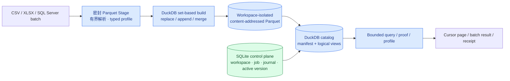

# 百万行数据面与性能合同

本文件是 AIBI-C 存储、导入、查询和容量验收的唯一技术合同。产品结果仍由 [PRD](PRD.md) 约束，当前完成度由 [实现状态](implementation-status.md) 维护；本文件不记录一次性耗时回执。

## 用户结果

- 一百万行级数据可以在普通本地工作站上预检、导入、合并、查询和恢复，不因 Python 对象展开或深分页而失控。
- 页面只等待当前查询，不为副本校验、关系推荐或无关组件重复扫描整张业务表。
- 每个数字继续绑定工作区、数据版本、字段结构、查询计划和证据回执；提速不得引入旧数据回退或未验证结果。
- 存储 generation 2 是一次明确断代：旧混合数据库只可离线保留，不读取、不迁移业务行，也不保留双写兼容路径。

## 权威边界

SQLite 只保存控制元数据。业务事实只存在于工作区隔离的不可变 Parquet 对象中；DuckDB 负责类型化执行、目录视图和可重建缓存。Python 和 TypeScript 只处理计划、合同、manifest 及有界结果，不持有全量业务行。

## 版本与发布

每个数据表版本包含：

- `versionId`：工作区、表、schema 指纹、内容指纹共同派生的稳定标识；
- `schemaFingerprint`：有序字段名与物理类型的摘要；
- `contentFingerprint`：全部不可变对象 hash、行数和 schema 的摘要；
- 一个或多个 `dataset_version_files`，路径只能是对象根目录内的相对 `objectKey`；
- 行数、列数、字段画像和来源引用，不包含公开绝对路径或业务样例行。

发布顺序固定为：准备不可变对象 → 校验行数/schema/hash/键质量 → Journal 记录 previous/target version → 原子更新 DuckDB manifest 与逻辑 view → SQLite 单事务切换 `active_version_id` 和 current source run → Journal finalized。任一失败只能暴露 previous 或 target 中一个版本；不存在 SQLite 业务表、SQLite→DuckDB 复制或查询期同步。

查询期只批量比较 manifest 与期望版本，并校验逻辑 view 绑定；整表 `COUNT(*)`、内容 hash 和对象 scrub 只在发布、启动对账或显式维护任务执行。

## 导入与画像算法

- CSV 由 DuckDB `read_csv` 直接进入 Parquet；不得先构造 `list[dict]`。
- XLSX/XLSM 采用流式 XML/批次读取，批次有硬上限；不得构造整张 sheet DOM。
- SQL Server 使用 `fetchmany`/Arrow batch 写 typed Parquet；不得经逐行 dict 和中间 CSV 再进入通用导入。
- 基础画像使用单次 DuckDB 聚合扫描批量计算 row/null/non-empty、类型成功率、有界 sample 和近似基数；候选唯一键再执行可追踪的 exact proof。
- merge preview 与 commit 共享相同的 key CTE。先对 incoming 用窗口函数稳定去重，再与 active relation 做 set-based join；`overwrite`、`fill-empty`、`skip-existing` 均生成新不可变版本，禁止逐行 SELECT/UPDATE/INSERT。
- 文件夹导入复用每个 sealed stage 的 manifest/profile/key stats；同一文件不得被预检链重复解析。

## 查询算法

- 明细使用绑定 `versionId + sort tuple + stable row id` 的 opaque keyset cursor；禁止 OFFSET 深分页。
- 未筛选总行数来自版本 manifest；筛选计数与结果共享一个 CTE/window，或显式异步计算，不为同一请求扫描三次。
- 数值和时间类型在发布时确定；查询热路不抽样判型、不逐行重复 `TRY_CAST`。
- 关系画像由 DuckDB 键计数 CTE、FULL JOIN 和有界 sample 计算；禁止把左右全表取回 Python。
- 已保存关系证明按精确 table versions 与 scope fingerprint 缓存；版本未变时查询不重算 proof。
- 排名、集中度、Pareto、分位和累计贡献使用 DuckDB window SQL，只返回硬上限内的证据行。
- 一个看板请求批量提交 widget plans，在同一 snapshot 中只校验一次 manifest；相容聚合允许通过 conditional aggregate 或 grouping sets 合并扫描。
- 任意知识规则必须声明 `scalar | bounded-group | bounded-detail`、硬行数和字节预算；无界 detail 在静态校验阶段拒绝。

## 缓存与失效

缓存键必须至少包含 `workspaceId + activeVersionIds + normalizedQueryFingerprint`。导入激活、语义发布、关系修改和筛选变化只失效精确依赖；不得用时间缓存掩盖版本漂移。缓存只保存有界结果与统计，不保存未受控业务行。

## 恢复与清理

恢复点保存控制面快照和 active version 引用，不复制业务数据。恢复是带 Journal 的指针切换；不可变对象由 active version、恢复点和运行中 Job 的引用共同保留。GC 只能删除三类引用均不存在且 hash 校验通过的对象。

## 静态禁止项

性能架构守卫必须阻断：

- SQLite 中的 `data_*` 业务行表和 `.sqlite` import stage；
- 生产导入/查询中的无界 `fetchall()`、全量 `list[dict]` 和每行业务 SQL；
- SQLite→DuckDB replica copy、全 VARCHAR 业务 schema 和查询期整表同步；
- 明细 SQL 的 `OFFSET`、每请求副本 `COUNT(*)` 校验和运行时抽样判型；
- 无硬 limit/byte budget 的业务结果接口；
- 旧 storage generation 的读取、迁移和 fallback。

## 百万行退出条件

基准数据固定由脚本确定性生成，不提交大型 fixture。参考环境为 8 核、16 GiB、NVMe；门禁同时记录机器信息，较慢环境可按校准系数调整绝对耗时，但算法复杂度断言不可放宽。

| 场景 | 退出条件 |
| --- | --- |
| CSV 导入 | `1,000,000 × 24` typed columns 的 sealed ingest + profile 冷运行不超过 45 秒，峰值 RSS 不超过 1.5 GiB |
| 内存复杂度 | 10M soak 的峰值内存不超过 1M 基准的 1.25 倍，证明按 batch/SQL 执行而非按行常驻 |
| Merge | 1M incoming 对 1M active 的 set-based merge 不超过 90 秒，无逐行数据库调用 |
| 明细分页 | 第 1 页和第 10,000 页 p95 同阶，SQL 无 OFFSET、无重复/漏行；版本变化使旧 cursor 明确失效 |
| 聚合 | 1M 简单 filter + SUM 冷查询不超过 1.5 秒，热 p95 不超过 300ms；group-by 冷查询不超过 2 秒 |
| 查询前置 | 单表热请求 0 次业务表 COUNT，N 表请求只执行一次 manifest 批量校验 |
| 关系画像 | 两张 1M 表的 Python RSS 增量低于 100 MiB，返回不超过 sample limit，小夹具指标与合同逐项一致 |
| 激活与恢复 | active version 或恢复点指针切换不超过 2 秒；崩溃注入后只暴露一个版本，启动对账不超过 10 秒 |
| 完整性 | row count、schema/content hash、selected-key uniqueness 和固定 aggregate checksum 全部通过；缺失或损坏对象 fail closed |
| API/UI | 单响应满足硬行数和字节预算；20-widget 首屏最多一个 batch 请求；取消和 stale response 不覆盖新结果 |

性能门禁必须同时报告耗时、p50/p95、峰值 RSS、扫描数、返回行/字节数和 EXPLAIN 摘要。只降低耗时但仍保留线性深分页、重复扫描或全量 Python 展开，不视为完成。

## 当前参考回执（2026-08-31）

以下数值来自同一工作区的隔离冷运行，只证明本次实现和机器，不替代上面的发布阈值。基准数据由脚本生成并在结束后删除。

| 场景 | 本次结果 |
| --- | --- |
| 1M × 25 发布 | 总计 2.121 秒；Parquet 0.931 秒、对象与元数据 0.068 秒、DuckDB view 0.395 秒 |
| manifest 校验 | 30 次，p95 1.91 ms；每次只读 manifest，不执行业务 `COUNT(*)` |
| 1M 聚合 | 5.05 ms |
| keyset 分页 | 首页 7.69 ms，中间页 7.68 ms；无 `OFFSET` |
| 1M × 24 CSV sealed stage | 3.770 秒；峰值 RSS 733,552,640 bytes |
| 1M active + 1M incoming merge | 1.5M 输出 0.802 秒；峰值 RSS 1,167,769,600 bytes |
| 原子备份恢复 | 29 项完整性、竞态、跨盘、崩溃、终态诊断写入和清理故障注入全部通过 |

对应入口为 `npm run verify:performance` 与 `npm run verify:backup`；任何性能实现变化都必须重新生成回执，而不能沿用本表。

## 开发顺序

1. 建立 clean schema、Parquet object store、dataset version manifest 和 O(1) relation resolver。
2. 切换 CSV/XLSX stage、SQL profile 与 set-based merge，删除 SQLite 业务写入和 replica copy。
3. 切换 keyset page、批量查询、关系/服装分析 SQL 和版本化证明缓存。
4. 把恢复点改为 version refs，加入安全 GC。
5. 加入百万行基准、复杂度静态守卫、故障注入与完整回归；全部通过后更新实现状态。
