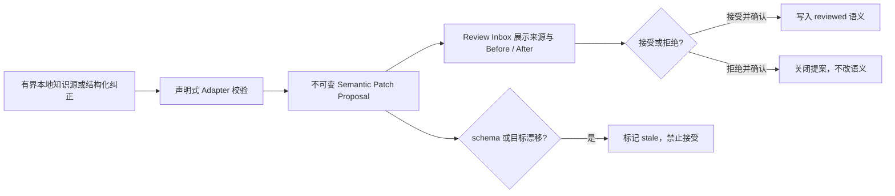

# 语义补丁与审核收件箱合同

本文件是 Knowledge Source Adapter、Knowledge Source Snapshot、Semantic Patch Proposal 和 Review Inbox 的唯一技术事实源。业务上下文分层见 [业务理解与分析 Skills](business-understanding-skills.md)，字段画像与规划指纹见 [工作区上下文目录](workspace-context-catalog.md)，当前交付状态见 [实现状态](implementation-status.md)。

## 目标与边界

用户纠正、数据字典和说明文档不能直接变成共享业务事实。AIBI-C 固定执行“适配 → 不可变提案 → 人工复核 → 明确确认 → 应用”的受控流程：

该流程不提供自动学习、任意 SQL、代码执行、网络抓取、跨仓库读取或聊天内容静默晋级。Provider、Skill 和 Domain Pack 均不能绕过审核。

## 三类 Adapter

| Adapter | 输入 | 允许来源 | 边界 |
| --- | --- | --- | --- |
| `knowledge-json-v1` | UTF-8 `.json` | 数据字典、说明文档 | 最大 512 KiB、最多 200 个语义条目 |
| `knowledge-markdown-v1` | 含且仅含一个 `aibi-knowledge` JSON fence 的 Markdown | 数据字典、说明文档 | Markdown 正文不持久化，只解析 fence 中的声明对象 |
| `user-correction-v1` | CLI/API 结构化字段 | 用户纠正 | 每次一个 term、rule 或 field-semantic |

统一输入 schema 为 `aibi-knowledge-source/v1`，只允许 `source`、`terms`、`rules` 和 `fieldSemantics`。未知字段以及 SQL、query、code、script、command、URL、credential、password、token、secret 等可执行或敏感字段在任何写入前阻断。其他 AIBI 仓库路径同样在读取前阻断。

Adapter 不保存原始文档、原始行或绝对路径。持久化的 `knowledge_sources` 只记录 Adapter、来源类型、名称、版本、内容指纹、脱敏 locator、条目计数和状态；同一内容重复接入保持幂等，不重置已接受或已拒绝的决定。

## Semantic Patch Proposal

`aibi-semantic-patch-proposal/v1` 是工作区隔离的不可变差异快照，包含：

- 来源 key、来源指纹、patch 类型、目标引用和 `create | update`；
- 归一化的 `before`、`after`、置信度和证据引用；
- 提案创建时的 workspace schema 指纹和目标指纹；
- `pending | accepted | rejected` 持久状态，以及运行时派生的 `stale` 状态；
- 审核决定、备注、时间和提案差异指纹。

Term 和 Rule 接受后写入 confirmed Context，来源为 `reviewed`；Field Semantic 接受后写入 `reviewed` 字段语义。`manual` 与 `reviewed` 都是确认权威，自动推断不得覆盖；候选仍不能授权 Join、指标公式或业务筛选。

## Freshness 与审核

待审核提案在每次读取和接受前检查：

1. Knowledge Source Snapshot 仍存在、状态有效且内容指纹一致；
2. 当前工作区 schema 指纹与提案创建时一致；
3. 当前目标内容与提案的 `before` 指纹一致。

任一条件变化时提案显示为 `stale`，接受被阻断；用户仍可预演并确认拒绝。接受和拒绝都必须先预演，再显式确认。接受在同一事务内应用语义并关闭提案；应用失败不会留下部分业务写入。

## 入口

| 目的 | CLI | HTTP / UI |
| --- | --- | --- |
| 查看 Adapter | `knowledge-source-adapters` | `GET /api/knowledge-source-adapters` |
| 查看来源快照 | `knowledge-sources [--workspace ID]` | `GET /api/knowledge-sources` |
| 生成提案 | `semantic-patch-propose ... [--yes]` | `POST /api/semantic-patches/propose` |
| 查看收件箱 | `semantic-patch-proposals ...` | `GET /api/semantic-patches` |
| 审核 | `semantic-patch-review --proposal KEY --decision accept|reject [--yes]` | `POST /api/semantic-patches/review` |

HTTP 只使用服务端活动工作区，不接受客户端提供任意 workspace id。设置页把来源、目标、置信度、状态、freshness 和 Before/After 放在同一审核卡片；用户纠正表单只生成提案，不再直接写入 Context。

## 可移植与生命周期

Context Term/Rule、Knowledge Source Snapshot 和 Semantic Patch Proposal 都进入元数据配置导出与恢复；导出不包含原始文档、绝对路径、业务行或凭据。删除工作区时同步删除其来源和提案。SQLite schema v8 通过受保护迁移引入这两张表，旧库不得在普通启动路径静默升级。

## 验收

| 场景 | 必须行为 |
| --- | --- |
| 接入 JSON / Markdown | 默认只预演；确认后只产生 pending 提案，不改共享语义 |
| 用户纠正 | 先提交审核，再单独预演接受或拒绝 |
| 重复接入相同内容 | 不复制提案，不重置终态决定 |
| schema 或目标变化 | 提案 stale，接受阻断，拒绝仍可完成 |
| 接受字段语义 | 来源为 reviewed，后续自动推断不能覆盖 |
| 跨工作区读取 | 不返回另一个工作区的来源或提案 |
| 导出、删除与迁移 | 审核状态可移植、随工作区删除、版本变化可被迁移工具检测 |

实时参数只以 [BI CLI 合同](bi-cli-contract.md) 为准；用户可观察行为只在 [产品验收矩阵](product-acceptance-matrix.md) 维护。
