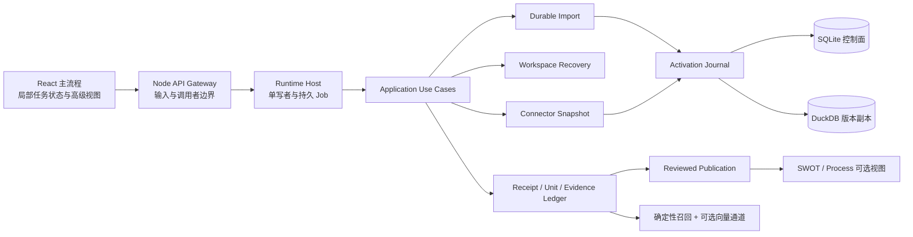
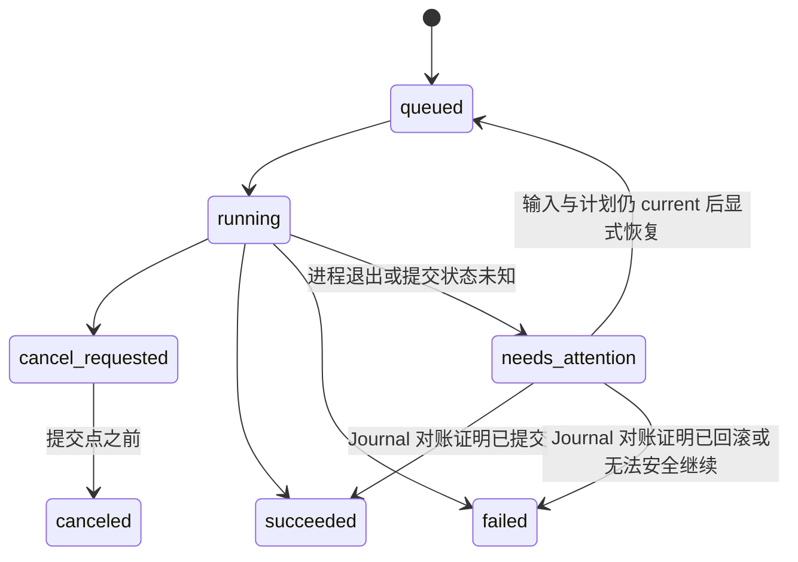

# AIBI-C 可信能力吸收开发规格

本文是 AIBI-C 吸收相邻产品工程经验的唯一执行规格。它只定义 AIBI-C 自有实现，不建立对其他 AIBI 仓库的源码、运行时、数据库、端口、测试数据或构建产物依赖。

当前能力事实见 [实现状态](implementation-status.md)，产品不变量见 [产品定位](../PRODUCT.md) 与 [产品需求](PRD.md)，未交付队列仍由 [未来开发队列](development-roadmap.md) 维护。本文负责本批能力的设计选择、工作包、合同、验收和退出顺序。

## 1. 目标与成功定义

本批目标不是增加更多入口，而是让“接入数据 → 生成证据 → 形成决策制品”在进程退出、重复请求、数据漂移和外部连接不稳定时仍然可信。

完成后，用户应获得以下结果：

1. 大文件或文件夹导入成为可查询、可取消、可恢复、可核对的持久任务。
2. SQLite 元数据控制面、Parquet 数据版本与 DuckDB 目录视图在公式、关系和查询语义上有可重复的等价性门禁。
3. 危险写入前可以创建、验证和恢复工作区恢复点，而不是只依赖隐藏备份文件。
4. 跨 SQLite、DuckDB 和文件 manifest 的来源激活具备明确阶段、崩溃对账和单写者约束。
5. 经人工审核的计划或决策制品能证明其证据链未被篡改，并能解释输入为何已经漂移。
6. SQL Server 作为可选只读快照来源接入现有 Adapter 边界；驱动、网络或权限不满足时安全不可用。
7. SWOT 和流程图只作为证据之后的可选决策视图，每条业务断言都能回到 Receipt。
8. 语义召回保留现有确定性基线，仅在离线评测证明收益时启用脱敏向量通道。

本批不以新增命令数量、页面数量或代码量作为成功标准。只有实现、专项验证、完整回归、真实 UI 路径和文档同时通过，能力才能进入实现状态。

## 2. Clean-room 与不变量

### 2.1 Clean-room 约束

- 相邻仓库仅提供问题拆解和验收思路；不得复制源码、Fixtures、数据库 schema、CSS、测试或命名空间。
- 所有实现从 AIBI-C 的现有 Command、Use Case、Repository、Receipt、Capability 和 UI 组件边界演进。
- 外部仓库的未提交文件只视为研究信号，不构成稳定合同或质量证明。
- 测试仅创建 AIBI-C 自有临时文件和临时数据库，不读取其他 AIBI 工作区。

### 2.2 产品与数据不变量

- SQLite 继续保存控制面、元数据、Job、审核状态和幂等回执。
- 业务事实只保存为内容寻址 Parquet 版本，DuckDB 维护版本化目录视图；SQLite 不保存业务行，不引入长期双写或隐式回退。
- 每个写动作只能通过一个确认面进入单写者队列；重复点击和响应丢失不得重复提交。
- 任何任务、恢复点、连接器、证据和决策制品都必须绑定 `workspaceId`。
- 原始业务行、密码、连接串、访问令牌、绝对路径和未脱敏自由文本不得进入 Provider、Trace、公开 Receipt 或 Git。
- 旧证据仍可查看，但非 current、链损坏或输入漂移时不得继续支持经营结论。
- 默认流程仍然只有一个当前主任务；高级恢复、连接器和决策框架按需展开。

## 3. 目标架构



新增能力必须复用现有调用方向：UI 只调用 API；API 只做协议适配；业务状态由 Python Use Case/服务持久化；Node 后台运行时只负责拥有和对账工作进程。

## 4. 公共合同

### 4.1 标识、时间和指纹

- `workspaceId`：当前工作区的规范化标识；所有读写查询都以它作为首要过滤条件。
- `requestKey`：调用方提供或由客户端稳定生成的 1–200 字符幂等键；相同键但不同输入必须返回冲突。
- `jobKey`、`recoveryPointKey`、`publicationKey`、`frameworkKey`：服务端生成的不透明标识，不携带路径或业务值。
- 时间使用 UTC ISO-8601；UI 本地化展示，但 Receipt 保留原始 UTC。
- 内容指纹统一为小写 SHA-256 十六进制；哈希输入使用 UTF-8、排序键和稳定 JSON。

### 4.2 新增 schema 名称

| Schema | 职责 |
| --- | --- |
| `aibi-import-job/v1` | 文件/文件夹导入任务、阶段、进度、取消与结果 |
| `aibi-source-activation-journal/v1` | 跨存储发布阶段、回滚材料和恢复结果 |
| `aibi-workspace-recovery-point/v2` | 工作区恢复点清单、完整性和生命周期 |
| `aibi-reviewed-publication/v1` | 经审核制品的内容、输入合同和漂移状态 |
| `aibi-evidence-ledger/v1` | 追加式证据条目及前序哈希 |
| `aibi-decision-framework/v1` | 证据绑定的 SWOT 或流程图制品 |
| `aibi-evidence-retrieval-receipt/v1` | 召回通道、分数、降级原因和语料指纹 |
| `aibi-sqlserver-snapshot-plan/v2` | SQL Server 目录选择、边界、水位线和有界批量 typed Parquet 快照计划 |

所有公共对象都包含 `schema`、`workspaceId`、自身 key、`createdAt` 或 `updatedAt`、输入/内容指纹和适用状态。前端类型不得在 `server/` 中反向导入。

### 4.3 状态与错误语义

错误必须包含稳定 `code`、面向用户的 `error`、可选 `recoveryAction` 和不会泄露秘密的技术细节。以下情况一律 fail closed：

- 计划指纹、文件哈希、父 `sourceRun`、schema 或工作区不匹配；
- Job 已进入终态后收到不兼容的重复请求；
- 恢复点 manifest、数据库哈希或证据链校验失败；
- SQL Server 目标不在 allowlist、DNS 解析出现非预期地址、选择无稳定排序或凭据不是 Secret Ref；
- 审核制品引用非 executed、非 current 或不完整 Receipt；
- 向量通道发现潜在原始 PII、Provider 未启用或评测门槛未通过。

## 5. 工作包与交付顺序

工作包按依赖顺序交付。可以并行开发，但必须按 `W0 → W1 → W2/W3 → W4/W5 → W6/W7` 集成和验收。

### 当前集成边界

| 工作包 | 当前状态 | 已交付边界 |
| --- | --- | --- |
| W0 | 已完成 | 跨 SQLite 与已发布 DuckDB 副本的等价性专项门禁已接入；查询只读已发布版本，副本缺失或绑定漂移时 fail closed，不在查询路径隐式同步或回退 SQLite。 |
| W1 | 已完成 | 文件与文件夹确认统一进入可查询、可取消、可恢复的持久 Import Job；`requestKey` 幂等、阶段事件、重启对账与全局单写者队列已接入。 |
| W2 | 已完成 | 工作区恢复点的创建、校验、预演恢复、确认恢复、删除、启动期未完成恢复对账及惰性 UI 已接入；路径与工作区边界由服务端决定。 |
| W3 | 已完成 | 来源激活 Journal、lease token/epoch、跨进程写锁、阶段对账与安全排队已接入；只有已校验并 finalized 的副本可成为 current。 |
| W4 | 已完成 | 审核制品、追加式 Ledger、内容与输入指纹复核、漂移/废弃状态及导出命令已接入；Evidence 高级区提供按工作区绑定的惰性列表、选中复核、安全导出和精确 Ledger head 两阶段停用，workspace 切换会取消请求并清空状态；候选不会自动发布，链损坏时只允许历史审计。 |
| W5 | 已完成（本地生产链） | SQL Server 的 `probe/test/discover/plan/snapshot`、密封暂存校验、标准 Durable Import 排队、Activation Journal 对账、启动恢复与惰性 UI 已接入；只有 Import Job `succeeded` 且 Journal `finalized/committed` 才返回 `active`。fake-driver 已覆盖完整 W1/W3，真实 SQL Server 未在无 opt-in 环境中执行或宣称。 |
| W6 | 已完成 | SWOT/流程框架的证据事实、人工判断与假设分类、发布门禁、CLI/API 和按需加载 UI 已接入；无 current evidence 时不生成已证明事实。 |
| W7 | 已完成（安全降级） | Provider-neutral 接口、固定离线评测、Retrieval Receipt、隐私门禁和确定性融合已接入；当前默认保持 `lexical_degraded`，未达到门槛不会自动启用向量通道。 |

“已完成”仅指上表限定的 AIBI-C v1 本地能力，不代表外部 SQL Server 环境已配置、向量 Provider 已获准启用或未来多人权限模型已经存在。

### W0｜公共基线与跨引擎等价性门禁（P0）

#### 用户结果

同一已确认来源版本从 typed Parquet 发布到 DuckDB 目录视图后，关键经营结果与 Receipt 版本绑定必须保持一致。

#### 实现范围

- 建立临时工作区夹具，覆盖：数值/空值/日期、中文字段、公式字段、单键与复合键关系、聚合、筛选、排序、分页和 drilldown。
- 对同一逻辑查询分别验证 SQLite 权威写入结果、DuckDB 已发布副本结果与对外 Query Receipt。
- 比较列名、类型、行顺序、空值、数值容差、数据版本、schema 指纹和关系路径；不得只比较总行数。
- 验证副本缺失、manifest 漂移、半发布和旧版本都被阻断，不能回退整表同步。
- 新增独立 npm 验证入口，并纳入 `verify` 或 `verify:ci` 的合适层级。

#### 退出条件

- 等价矩阵全部在隔离临时目录运行，不污染真实数据库。
- 公式、计算字段和复合关系至少各有一项正例和一项漂移/拒绝例。
- 重复运行结果稳定，失败输出能指出 engine、case、query 和首个差异。

### W1｜持久化导入任务（P0）

#### 用户结果

用户确认导入后可以离开页面或重启本地服务；重新打开工作区仍能看到任务的真实阶段、结果或恢复动作。取消只影响尚未提交的阶段，已完成写入不会被伪装成已取消。

#### 状态机



`stage` 至少区分 `validate_plan`、`stage_source`、`publish_replica`、`switch_source_run`、`postprocess` 和 `reconcile`。进度只能单调增加；阶段切换与事件追加在同一 SQLite 事务中完成。

#### 后端与存储

- 扩展现有通用 Job 表和事件表，新增 `kind=import`，不建立第二套互不兼容的任务中心。
- 创建 Job 时冻结 Import Plan、来源内容哈希、父 `sourceRun`、目标表、模式、键策略和 `requestKey`。
- 运行前重新校验文件、计划和父版本；任何漂移在零业务写入时结束。
- 旧 CLI 命令名可以保持兼容，但确认执行必须复用同一 Durable Import 生命周期；生产 API、测试和自动化都不得另开同步直写旁路。
- 重启恢复先读取 Activation Journal：只有尚未进入不可逆提交点且输入仍 current 的任务才能重排队。
- 取消请求持久化；运行器在每个阶段边界协作检查。进程信号只是加速手段，不是取消事实来源。

#### API 与 UI

- `POST /api/import/jobs`：以已确认计划创建任务，返回 `202` 和 Job Receipt。
- `GET /api/import/jobs/:jobKey`：返回状态、事件摘要、结果和恢复动作。
- `POST /api/import/jobs/:jobKey/cancel`：持久化取消请求。
- `POST /api/import/jobs/:jobKey/resume`：仅处理 `needs_attention` 且通过 current 校验的任务。
- UI 在数据工作台内显示当前任务；历史任务仍在高级管理区。刷新后按 workspace 和 job key 重新挂接，不全量刷新整个应用。
- 任务详情默认展示业务阶段、进度和下一步；JSON Receipt 放在折叠技术详情中。

#### 退出条件

- 覆盖双击、响应丢失、进程退出、取消竞态、文件漂移、父版本漂移、DuckDB 发布失败和 postprocess 失败。
- 相同 `requestKey` 与相同输入只产生一个任务；相同键不同输入返回冲突。
- 真实 UI 测试验证创建、刷新重挂、取消、失败恢复和成功后工作台重新水合。

### W2｜工作区恢复点（P0）

#### 用户结果

在导入替换、来源激活、迁移或其他危险写入前，用户能看到已验证恢复点，并可先预演恢复影响再确认。

#### 数据与文件边界

- 恢复点是工作区隔离的内部制品，存放于可配置的 AIBI-C 数据目录；路径不得来自请求体直接拼接。
- manifest 记录工作区、schema 版本、SQLite 控制面快照、DuckDB 副本/manifest、来源版本、文件大小、SHA-256、创建原因和状态。
- 恢复点创建先写临时目录，逐文件 fsync/校验后原子改名为 `ready`；任何中断不得留下可恢复的半成品。
- v1 只允许恢复到原工作区；不得覆盖其他工作区，不提供任意路径导入。
- 恢复前再次验证 manifest 和所有内容哈希，并为当前状态创建安全恢复点。
- 恢复使用正向 allowlist，只回退当前业务配置和物理来源数据；未经明确评审的新工作区表默认不可恢复。
- Publication/Ledger、Query/Analysis/Retrieval Receipt、来源历史、Import Job/Event、Activation Journal/Event 和 lease 等证据与运行控制事实原样保留；数据回退后它们按 current binding 变为 stale，不删除、不复活。

#### 命令、API 与 UI

- CLI 提供 list/inspect/create/restore/delete；create、restore、delete 均 dry-run first，确认必须复用预演指纹。
- API 只映射版本化命令，owner 权限、同源令牌和幂等边界在业务调用前检查。
- 设置页新增惰性加载的“工作区恢复”区域：默认只显示健康状态和最近恢复点；完整列表、校验、恢复和清理按需展开。
- 恢复成功返回受影响资源和 invalidation keys，使 UI 只重新拉取当前工作区。

#### 退出条件

- 验证损坏 manifest、数据库哈希不符、路径穿越、符号链接、磁盘不足、创建中断、恢复中断和跨工作区请求。
- 验证恢复后 SQLite、DuckDB manifest、current `sourceRun`、关系、看板和 Query freshness 一致。
- 验证恢复点之后追加的 Ledger、Publication、Receipt、终态 Job/Event 与 finalized Activation 逐行保留，不复活 queued/running Job 或 active lease；同一对账重放幂等。
- 恢复失败必须保留恢复前安全点，并给出确定性后续动作。

### W3｜来源激活日志与单写者对账（P0/P1）

#### 用户结果

导入或连接器同步即使在 SQLite 提交、DuckDB 发布和 manifest 切换之间崩溃，也不会出现两个“current”或用旧副本冒充成功。

#### 阶段合同

```text
prepared
  -> commit_started
  -> replica_published
  -> source_selection_committed
  -> finalized
```

- `prepared` 保存旧/新来源版本、目标表、计划指纹、回滚材料和预期 DuckDB manifest。
- `commit_started` 之后禁止另一个同工作区激活进入写区。
- `replica_published` 是内部历史 phase 名，证明新数据集目录视图已完整校验，但尚不代表 active pointer 已切换。
- `source_selection_committed` 证明 SQLite current 指针已提交。
- `finalized` 清理暂存与旧 journal；清理失败只产生 maintenance warning，不改变提交事实。

#### 对账规则

- 启动期和新写入前都扫描非终态 journal。
- current 指针仍为旧版本且新副本未发布时回滚；副本已发布但指针未切换时依据 journal 的单一提交意图完成或回滚；指针已切换时只允许验证并 finalize。
- 每种故障位置都必须有注入测试；恢复过程本身幂等。
- Runtime Host 单写者负责进程内排队，跨进程写锁只为独立 CLI、恢复与 worker 建立互斥围栏；Journal 负责进程退出后的事实恢复，三者不得形成彼此独立的状态机。

### W4｜审核制品、证据链与漂移（P1）

#### 用户结果

用户保存一份经审核的分析计划或决策制品后，可以确认内容、引用证据和输入版本未被改变；数据更新时能看到具体漂移原因。

#### 证据链

- Ledger 条目为追加式：`entryKey`、`sequence`、`kind`、`payloadFingerprint`、`previousHash`、`entryHash`、证据引用和时间。
- `entryHash = sha256(stableJson(entryWithoutHash))`；首条使用固定 genesis 值。
- 验证必须同时检查序号连续、前序哈希、内容哈希、工作区和所引用 Receipt/Unit 的 current 状态。
- 链损坏时制品仍可只读展示，但状态必须为 `integrity_failed`，不得导出为 current 决策依据。

#### 审核发布与漂移

- 发布输入合同至少包含 source/data/schema/relationship/domain pack/skill/query receipt/result 指纹。
- 状态为 `current | stale | integrity_failed | deprecated`；漂移原因使用稳定枚举并可附当前/原值摘要。
- 发布是现有 Confirmed Plan Memory 之上的显式动作；召回候选本身不能自动发布。
- UI 只在存在 executed 且 current 的 Analysis Unit 时提供“保存审核版本”，并把链校验和漂移详情放在证据面板。

#### 工作区删除审计闭环

- 删除预演冻结工作区状态、影响计数、物理表、Publication key、Ledger head、`requestKey` 哈希和计划指纹；确认必须沿用同一 `requestKey` 与预演指纹。
- 确认在 `BEGIN IMMEDIATE` 内先验证全部 Ledger，再为每个 Publication 追加一次 tombstone；任一链损坏时事务整体回滚，业务数据零删除。
- tombstone 后创建并再次 inspect 工作区隔离的安全恢复点；恢复点包含删除前最终审计链，删除动作再按 `prepared → duckdb_deleted → sqlite_deleted → completed` 写入内容指纹回执。
- 启动对账只重放有完整安全恢复点的中间阶段；无法证明安全状态时写为 `needs_attention` 并保持全局恢复栅栏。完成回执在工作区行已删除后仍支持同 `requestKey` 幂等回放。

#### 退出条件

- 覆盖篡改内容、删除中间条目、跨工作区引用、来源/关系/Pack/Skill 漂移和 legacy 数据迁移。
- 导出、恢复和工作区删除遵守 ledger 引用与 tombstone 规则。
- 工作区删除覆盖零写预演、坏链阻断、tombstone 单次追加、审计快照、同 key 回放、异计划冲突、跨工作区不变及各持久阶段的启动对账。

### W5｜SQL Server 只读快照 Adapter（P1）

#### 用户结果

用户可以连接已获授权的 SQL Server，选择表或视图，预览有界 schema/样本统计，再把稳定快照作为普通 AIBI-C 来源导入；整个过程不授予远端写权限。

#### 安全合同

- 连接配置只保存主机别名、端口、数据库、加密策略、资源选择和 `credentialRef`；不得保存密码或完整连接串。
- 主机必须通过显式 allowlist、DNS 解析与 IP 分类检查；解析漂移、loopback/private 范围不符、重定向或命名实例隐式发现全部阻断。
- 连接必须声明只读、连接/查询超时、最大表数、最大列数、最大行数、最大字节数和并发 1。
- 默认拒绝任意 SQL；只从系统目录生成受限 SELECT。标识符引用由 Adapter 完成，用户文本不能进入 SQL 结构。
- 每张表必须绑定主键/唯一键或经用户确认的稳定排序；增量模式额外要求可比较水位线和确定性并列键。

#### 能力层级

1. `unavailable`：驱动不存在或环境未配置；UI 解释安装/配置要求，不显示可执行按钮。
2. `ready_for_test`：网络策略和 Secret Ref 可用，可执行只读连接测试。
3. `ready_for_snapshot`：目录、选择、排序、水位线和预算全部通过，可生成快照计划。
4. `active`：确认计划通过 Durable Import 与 Activation Journal 发布。

不得自动安装驱动，不得因 SQL Server 不可用回退到 SQLite 文件或 HTTP Adapter。

#### Adapter 操作

- `probe`：只报告驱动和策略能力，不接触凭据。
- `test`：验证 TLS、身份、数据库只读权限和超时。
- `discover`：读取有界 schema/catalog，不返回原始业务行。
- `preview`：返回字段、行数估计和最多若干脱敏样本统计。
- `plan`：冻结目录哈希、选择、排序、水位线、预算和目标映射。
- `snapshot`：写入工作区暂存目录，逐表校验后交给 W1/W3 发布。
- `activate`：再次校验工作区、计划、manifest 与密封文件集，把暂存目录作为普通 folder import 输入交给现有全局单写者队列。
- `activation-status/finalize`：复核 Import Job 私有绑定、current source run 与 `finalized/committed` Journal；未满足时继续显示 queued/running/needs-attention，不得提升为 `active`。

#### 退出条件

- fake-driver 必须覆盖 stage → Durable Import → Activation Journal → active 的完整 W1/W3 生产链；显式 opt-in 的真实集成入口保留，但 CI 和本轮完成声明不依赖、也不冒充外部 SQL Server 已执行。
- 覆盖 Secret 泄露扫描、DNS rebinding、无稳定排序、超预算、超时、部分表失败、取消和重复请求。

### W6｜证据绑定决策框架（P2）

#### 用户结果

业务用户可以把当前可信分析整理成 SWOT 或流程图，而不必学习模型结构；系统清楚区分“证据事实”“用户判断”和“待验证假设”。

#### 合同与交互

- 框架类型首版仅为 `swot` 与 `process`。
- 每条 claim 包含 `claimKey`、类别、文本、`claimKind`、evidenceRefs、作者、状态和内容指纹。
- `claimKind` 仅允许 `evidence_fact | user_judgment | hypothesis`：
  - `evidence_fact` 必须绑定 current executed Receipt；
  - `user_judgment` 明确标记为人工输入；
  - `hypothesis` 必须展示验证需求，不能计入已证明结论。
- 默认从证据生成结构骨架和候选事实，不自动编造机会、威胁、因果或行动建议。
- 编辑、保存、发布仍使用一次确认边界；发布后由 W4 提供证据链与漂移状态。

#### UI 与性能

- 决策框架是分析结果后的可选入口，不新增顶级导航。
- 编辑器动态加载；列表与画布长内容使用 `content-visibility` 或分页。
- 只订阅当前 framework key 和派生状态；避免把整个 Agent answer 或工作区 payload 作为 effect 依赖。
- 720 像素短边仍维持可读触控目标；更小窗口沿用全局缩放规则。

#### 退出条件

- 无证据时不能创建 `evidence_fact`；证据漂移后数字和事实标签立即卸载为 stale。
- 键盘、窄屏、长文本、中英文和导出路径通过验证。

### W7｜混合证据召回评测与受控启用（P2，门槛式）

#### 用户结果

同义表达和跨语言业务问法更容易找到正确的已确认计划，同时不会因为向量相似度绕过表、关系、freshness 或权限门禁。

#### 实现范围

- 保留现有 lexical、字符 n-gram、结构化计划重合和 freshness 作为稳定基线。
- 新增 Provider-neutral embedding 接口；默认 `disabled`，没有经过审核的本地 Provider 时进入 `lexical_degraded`。
- embedding 输入只允许字段标签、指标名、别名和已确认的短问题摘要；原始行、文档正文、凭据、绝对路径和潜在 PII 必须拒绝或脱敏。
- 使用 RRF 或等价的确定性融合；向量分数不能覆盖 workspace、显式表、证据 current 和关系安全硬过滤。
- Retrieval Receipt 记录启用通道、Provider 签名、语料指纹、候选分解分数、降级原因和零原始行证明。

#### 启用门槛

- 建立固定、领域中立、无用户数据的离线案例集，至少覆盖同义、中文/英文、字段竞争、跨表、stale 和无匹配。
- 与基线比较 Recall@K、MRR、错误表命中和 stale 候选率；任何隔离、stale 或错误表零容忍项失败都禁止启用。
- 只有质量提升达到规格中固定的最小阈值、延迟/内存预算通过且隐私扫描为零时，工作区才可显式启用向量通道。
- 未达到门槛本身是合格结果：接口、评测和安全降级交付，但产品状态保持 `lexical_degraded`。

## 6. 数据迁移与兼容

- 只追加 schema migration；旧数据库启动时创建新表/列，现有 CLI 和 API 返回字段保持兼容。
- 新表必须带 workspace 索引、状态索引和唯一幂等约束；外键或应用校验不得产生跨工作区引用。
- legacy Import Job 记录继续作为历史回执展示，不伪造为新的持久任务。
- legacy Confirmed Plan Memory 默认未发布；只有用户显式审核后才能形成 Publication 和 Ledger genesis。
- 新增文件制品的根目录均可通过测试环境变量覆盖，测试结束后删除。
- 配置导出只包含非秘密设置；恢复点、暂存快照、数据库副本和 embedding 缓存不进入 Git 或普通配置导出。

## 7. API、Capability 与权限矩阵

v1 是 single-user、local-only 产品。“本地 owner”表示拥有当前 AIBI-C 本地进程与工作区的同一用户，不是已经实现的 RBAC 角色。只读请求仍须通过 loopback Host/Origin 与当前工作区边界；所有 mutation（包括只写任务/评测回执，或主动使用凭据发起远端只读访问）都必须在 handler 前校验启动期 runtime token。未来多人 `viewer/operator/owner` RBAC 不属于本轮，也不得用文档角色名伪装成当前授权能力。

| 能力 | v1 调用边界 | 写入/外部动作 | 确认与任务语义 |
| --- | --- | --- | --- |
| 查看 Import Job、恢复点、Publication/Ledger 与召回状态 | 同机本地 owner；loopback、Origin 与 workspace 校验 | 无 | 只读，不要求 runtime token |
| 创建/取消/恢复 Import Job | 同机本地 owner + runtime token | 本地全局单写者 | 创建复用导入计划确认；恢复需显式动作；Job 化 |
| 创建/恢复/删除恢复点 | 同机本地 owner + runtime token | 本地全局单写者 | dry-run first，确认绑定预演指纹；长操作可 Job 化 |
| 发布/废弃审核制品 | 同机本地 owner + runtime token | 本地单写者与追加式 Ledger | 显式确认；不自动发布 |
| SQL Server probe | 同机本地 owner；loopback 与 workspace 校验 | 只检查本地驱动/策略，不接触凭据 | 只读 |
| SQL Server test/discover/plan/stage | 同机本地 owner + runtime token | 经 allowlist 的远端只读访问；本地暂存写入 | 主动使用凭据必须是显式动作；stage 可取消；不自动激活 |
| SQL Server activation/status | mutation 为同机本地 owner + runtime token；status 只需 loopback 与 workspace 校验 | 复用本地 Durable Import、单写者队列与 Activation Journal；无远端写入 | 激活显式确认并绑定 plan/manifest/requestKey；Journal finalized 前不显示 active |
| 编辑或发布决策框架 | 同机本地 owner + runtime token | 本地单写者 | 草稿写入也校验 token；发布额外确认并绑定 current evidence |
| 运行召回评测 | 同机本地 owner + runtime token | 仅写脱敏评测回执 | 显式动作；不因此启用向量通道 |

Capability Contract、调用者边界和 mutation runtime token 必须先于 handler 检查。任何响应都不得返回 Secret Ref、绝对路径、原始业务行或未脱敏连接诊断。

## 8. UI 信息架构

- **工作区主任务**：只显示当前导入/画像/分析的下一步，不堆叠所有后台功能。
- **数据工作台**：显示当前 Import Job、Connector Snapshot 和来源激活状态；错误靠近触发点，成功后局部刷新来源资源。
- **证据面板**：显示 Publication、Ledger 校验、漂移原因和决策框架入口。
- **设置高级区**：显示工作区恢复、SQL Server 环境能力和召回评测；全部惰性加载。
- **任务历史**：只展示脱敏摘要，详细 JSON Receipt 折叠；大事件列表分页或虚拟化。

新增组件遵守 [设计系统](../DESIGN.md)：不引入另一套颜色、阴影、按钮或字体；不增加重复页面标题；状态不能只靠颜色表达。

## 9. 测试与故障注入矩阵

### 9.1 单元与合同

- 稳定 JSON、SHA-256、幂等摘要、状态转换、漂移枚举、路径与 Secret 脱敏。
- Import Job、Recovery Point、Activation Journal、Publication、Ledger、Framework、Retrieval Receipt 和 SQL Server Plan schema。
- Python/TypeScript 公共字段通过同源 fixture 校验。

### 9.2 集成

- 进程在每个 Import/Activation 阶段退出后重新启动并对账。
- SQLite 写入成功而 DuckDB 发布失败、DuckDB 发布成功而 current 指针未切换、finalize 清理失败。
- 恢复点创建/恢复期间磁盘不足、内容被篡改和相同 `requestKey` 重放。
- SQL Server fake-driver 的目录漂移、分页、水位线、稳定排序、超时和取消。
- Publication 引用的 source/schema/relationship/Pack/Skill 任一漂移。

### 9.3 浏览器

- 导入确认后收到 `202`，显示阶段；刷新后重挂；取消与恢复动作可见且状态不倒退。
- 恢复点预演和确认不泄露路径；恢复后当前对象与数字重新加载。
- SQL Server unavailable 与 ready 状态不混淆；未配置时不能点击同步。
- SWOT/流程视图在 1280×720、720×1280 和常用桌面尺寸无溢出，键盘顺序正确。
- 控制台零未处理错误；失败不显示旧数字或成功 Toast。

### 9.4 发布门禁

专项命令必须加入 `package.json`，最终至少运行：文档、架构、TypeScript/build、新专项、现有导入/Job/快照/Connector/Confirmed Memory、真实 UI 和完整 `preflight -- --stop-after`。服务只由本轮启动脚本拥有并在结束时停止。

## 10. 工作拆分与集成规则

| 批次 | 主要范围 | 建议文件所有权 | 依赖 |
| --- | --- | --- | --- |
| A | W0、W1、W3 | `tools/*import*`、Job/Journal 服务、Source route、导入任务 UI、专项验证 | 无 |
| B | W2 | Recovery 服务、CLI/route、设置面板、恢复专项验证 | W0 合同；可并行开发 |
| C | W4、W7 | Confirmed Plan、Ledger、Retrieval、证据 UI、评测 | W0；不依赖导入实现 |
| D | W5 | Connector Adapter、网络/Secret 策略、SQL Server fake-driver 测试 | W1/W3 集成点 |
| E | W6 | Decision Framework service、CLI/API、惰性 UI、可访问性验证 | W4 发布接口 |

并行开发只能在上述主要所有权内修改。公共 parser、registry、schema、`package.json`、`docs/implementation-status.md` 和生成的 CLI 合同由主审查者统一集成，避免并发覆盖。

## 11. 审查清单

主审查者逐包检查：

1. 是否保持 AIBI-C 根目录、远端、端口和数据库隔离。
2. 是否复用现有 Use Case、Job、Receipt、Capability、单写者和确认边界。
3. 是否出现 server → UI 反向依赖、任意 SQL、任意路径、自动安装依赖或秘密持久化。
4. 是否存在静默 fallback、第一张表默认选择、旧证据冒充 current 或取消状态倒退。
5. 是否有故障注入、跨工作区负例、幂等重放和真实 UI 证据。
6. React 是否避免请求瀑布、全量刷新、重型静态导入、对象型 effect 依赖和不必要重渲染。
7. 文档是否把“合同已存在”与“真实环境已可用”分开表述。

## 12. 总退出条件

本计划只有同时满足以下条件才算完成：

- W0–W6 全部实现并通过专项门禁；W7 至少完成接口、隐私门禁、离线评测和安全降级，只有达到质量门槛才允许默认之外的显式启用。
- 生产 API 不为新增长任务创建无约束同步写流程；所有写入仍进入唯一单写者边界。
- SQLite 元数据控制面、Parquet 业务事实与 DuckDB 目录视图职责固定，没有业务行双写和隐式 engine fallback。
- UI 保持一个当前主任务，高级功能惰性加载，720 像素短边验收通过。
- `docs/implementation-status.md` 只记录实际交付能力和仍存在的限制；本文完成项不再在路线图重复维护。
- 工作树经过主审查者确认，完整验证通过，最终只在 `main` 集成；不保留临时分支、额外 worktree、真实用户数据、日志或测试数据库。
